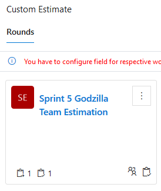

## Quick steps to get started

### Create a new Estimation Game

*	Opt 1: From a board, click the “…” beside your work item, select “Estimate work item(s)”
*	Opt 2: From the left menu, select “Boards/Estimation Poker”, and then “+Start your Game here”

### Configure your Game

*	Enter a “Title” for your game
*	Select “Online” to view the estimations from your team real-time
*	Additional items may appear depending on how you started your game. Ex: select Team and sprint, select query…
*	Select the type of estimation you want to use (T-Shirt sizes, Fibonacci…) through the “Cards” field
*	Click “Create”
*	This will create a new game on the “Estimation Poker” hub

### Invite your team members to the game

*	From the left menu, select “Boards/Estimation Poker”, and then Select the game

### Estimate

*	Pick the Work Item to estimate from the “Pending Estimates” section
*	Have your team members vote by selecting a card under “Your Vote” section
*	Once all votes are in, click “Reveal”
*	Reach consensus on the estimation, you can re-vote if necessary

### Select the final estimation for your work item to be updated

*	Once consensus is reached, select the final card/estimation under “Actions” section
*	This will update the “Story Points | Points du récit:” field of your work item

### Repeat with your next work items
