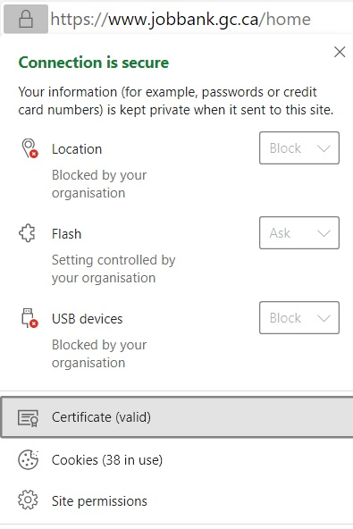
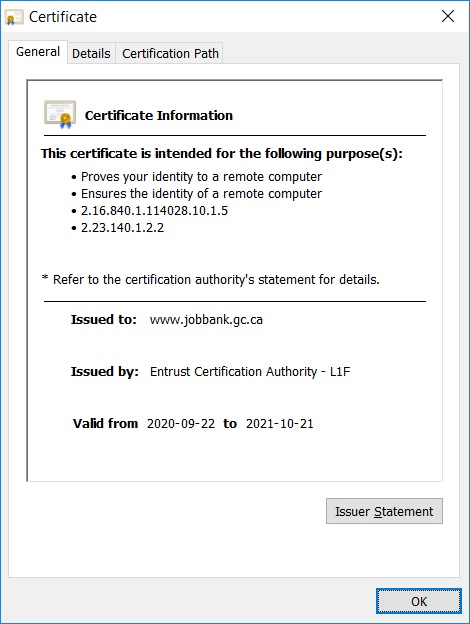

### For solutions hosted in Shared Services Canada (SSC) the following practice should be implemented.

TLS licences are renewed by SSC without the need for any client intervention. SSC has it's own internal process for renewing TLS licences. However, on rare occasions, SSC can forget to renew a TLS licence causing a server outage.

Open a NSD ticket if your TLS certificate is expiring in 14 days or less.

### Get your TLS Expiration date

Here are some methods to monitor your TLS certification expiry date.

#### Using a web browser:

For Edge and Chrome:

* Open web browser, navigate to your production hosted web site.
* Click on the "padlock" icon and select "certificate"

* Note the Certificate expiration date

For FireFox:

* Open web browser, navigate to your production hosted web site.
* Click on the "padlock" icon and select the arrow next to the certificate info (secure)

* Note the Certificate expiration date

*Once the TLS certification expiry date is known, create a reminder 14 days before the TLS expiry using Outlook Calendar or your desired tool. Include Developers, Technical Advisors and 24-7 support staff.*

#### Using Source code:

You can implement TLS expiration verification using code. Your team can include TLS verification in your custom monitor solution.

SDS is offering  flavors of code snippets you can implement in your monitoring solution(Java, C# & .Net).
The code snippets functions require the URL to be verified as a string parameter and returns the amount of days before TLS expiry.
In your monitoring solution, you can implement the desired code snippet to display a message or send a notification when expiry is less than 14 days.

Here is the link to the [code snippets](https://gccode.ssc-spc.gc.ca/iitb-dgiit/sds/devcop-code-snippets/-/snippets "code snippets").

### NSD ticket for TLS certificate renewal

*NOTE: Open a NSD ticket only if your TLS certificate is expiring in 14 days or less. Always verify if a certificate has been renewed before submitting an NSD ticket.*

To open a Ticket:

* Navigate to [NSD](http://srmis-sigdi-iagent.prv/ "NSD")
* Enter 'Windows Server" on the first textbox and select "I have a windows server issue for Shared Services" from the drop down list.

* In the "Service Request Details" field specify:
  * Please assign to SSC Resolver group name DC000152
  * Your TLS certificate expirations date.
  * Your production URL
  * List of Producton web server names

Here is a template you can use to submit your NSD ticket. Simply replace the %variables% with your own values.

Hello,

Please assign to SSC Resolver group name DC000152

Our TLS Certificates for the %production_url% will expire on %expiration_date%.

Please renew our TLS certificates for the following web servers:

%server_name_1%, %server_name_2%, %server_name_3%, %server_name_4%
