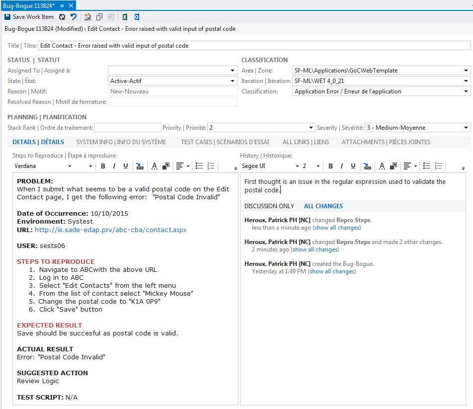
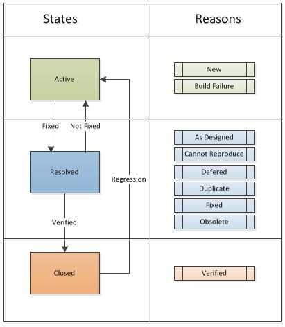

**Warning**: This Recommendation may be out of date. Please be critical when reviewing the information. If you know details to be different that stated, please update them.

**Recommendation**  
The following recommendation targets all development streams and comes from a joint effort between developers and testers and is approved by the CS-03 Technical Advisors.

**Scope of the recommendation:** This recommendation should be used by any person that performs testing activities against a solution and targets the default Agile Template of TFS 2010 for their bug reporting.  
**Out of Scope:** Git technologies  
**Definition:** Bug reporting is the activity of raising and tracking defects of an application or product.  
**Usage:** Application development, Testing (clients, testing services, performance, security, web accessibility...), ALM  
**Alternative use:**

## Contents

* [Assumptions](#assumptions)
* [Tools](#tools)
* [Actors](#actors)
* [Fields of a Bug](#fields-of-a-bug)
* [Bug Reporting Process](#bug-reporting-process)
* [Team Queries](#team-queries)
* [Build Definition Naming Convention](#build-definition-naming-convention)
* [Testing Complex or Multi-Application Solutions](#testing-complex-or-multi-application-solutions)
* [Template for "Details = Steps to Reproduce" Field](#template-for-details-steps-to-reproduce-field)

## Assumptions

For the recommendation to work, the following is assumed:

* TFS 2010 is used for bug tracking
* The default "Agile Template" is used by your project collection
* TFS "Areas" are used to identify the components that make up your solution. Ex: ROEWeb, RDMS, ROEServices
* TFS "Iterations" are used to identify the release. Ex: Spring 2016, .Net 4.5 Upgrade, SCAWSI implementation
* The "Found In Build" and "Integration In Build" are populated.
  * The Build Server should be used to automatically populate these 2 fields
  * Optionally the fields can be populated manually via the Global List.

## Tools

TFS (Team Foundation Server) is the official department tool to create, manage and track Bugs. TFS can be accessed through Visual Studio, Eclipse and Team Web Access.

For emerging tools visit: Bug Tracking Technology Brick

## Actors

Below are the definitions and responsibilities of the actors involved in Bug Reporting. The roles are meant to guide the process and do not necessarily reflect a dedicated resource of your team. When your resource is performing a particular task in the bug reporting process, they are wearing the hat of the role with that responsibility.

### Reporter

The Reporter is the person that found and reported the issue.  
This person can be from Testing (Testing Services, Security Testing and Performance Testing), Program Area (clients), Development team, Build Process  
They can usually create the Bug in TFS directly.  
Bugs can also come from users of the system which are usually reported via Help Desk. They can also come from reports such of the Web Standards Center of Excellence application scans. These Bugs are usually entered in TFS manually by a Reporter.

### Dev Coordinator

The Dev Coordinator is usually a member of the Development Team, or the Product Manager.  
Their role is to first analyze and triage the Bugs and assign the bugs to the proper Resolver for resolution.  
They can also negotiate with Testing and Clients to determine when and if the bug should be addressed now or at a later date.

### Resolver

The Resolver is the person that will further analyze and address the issues reported by performing changes to the application or product.  
This person is usually a member of the Development Team, or the Product Manager.

### TST Coordinator

The TST Coordinator is usually a member of the Testing Team.  
Their role is to analyze the Resolved bugs and assign them to the proper Validator for testing.

### Validator

The Validator is the person that will test the resolution and determine if the issue is properly resolved.  
The Validator is usually the same person as the Reporter of the issue but can be another person.  
The Validator will set the bug to the Closed state.

## Fields of a Bug

The fields available in the Bug work item type have been designed to help with tracking, reporting and to collaborate efficiently. To document the defect, the fields need to be properly populated and can be updated during the bug reporting process as details of the defect unfold. Incorrect values can impact the results of queries, which are used to list and assign work to individuals.

Below are the recommendations for the main fields of the Bug Work Item. Fields marked with an  are the most crucial to populate.

### Title:

* must be short, simple and precise to the issue found
* must have meaning
* allows you to distinguish from other bugs
* is easy to identify the source of the problem (e.g., include page, or action)
* should not contain details found in other fields (area, iteration, build, environment...)
* If the is bug generated from an external source (help desk), the tracking number used by that tool should be included in the title. (ex: SRMIS #)

    Examples:
    Registration - Search field label reads "Period"; should read "Period Submitted"
    Edit Contact - Error raised with valid postal code
    SRMIS* 1273664 - User cannot log in
    Search - possible SQL Injection

### Assign To:

* Identifies who in the project team is responsible for taking action on the work item.
* Generic lists should be used when assigning to the Dev Coordinator and TST Coordinator.
* The Dev and TST Coordinators will select the specific resource once it's decided who will action the work item.

### States and Reasons

Below you will find the States and their available Reasons for the work item type Bug in the default Agile Template.

### Area

* Identifies the application, component or module impacted
* It can be modified when the resolution of the bug is found. Example: the area selected at the creation of the Bug was "MSCBA Web" but after investigation the issue was in the Stored Procedure and the area was modified to reflect this.
* Do not use Area to group and/or track bugs raised by Security/Performance testing. The field "Classification" should be used for this.

### Iteration:

* Iterations are a way to identify the cycle/release/milestone/sprint you are working on.

### Classification:

* Provides insight into the type of issue or bug encountered. (Example: Documentation Issue, Security Issue, Design Flaw etc...)
* It should be used to filter issues raised by IT Sec, Performance, Web Accessibility etc...

### Stack Rank:

Used by the Agile Methodology and is a number usually assigned by a background process used to track the order of items on a backlog or board.

### Priority:

A subjective rating as to the importance of the bug and when it should be addressed.

### Severity:

A subjective rating of the impact of a bug on the project or software system. For example: If clicking a remote link (a rare event) causes an application or web page to crash (a severe customer experience), you might specify Severity = 2 - High and Priority = 3. Allowed values and suggested guidelines are:

1. Critical: Must fix. A defect that causes termination of one or more system components or the complete system, or causes extensive data corruption. And, there are no acceptable alternative methods to achieve required results.
2. High: Consider fix. A defect that causes termination of one or more system components or the complete system, or causes extensive data corruption. However, an acceptable alternative method exists to achieve required results.
3. Medium: (Default) A defect that causes the system to produce incorrect, incomplete or inconsistent results.
4. Low: A minor or cosmetic defect that has acceptable workarounds to achieve required results.

### System Info:

* Tells us in which Build a bug was found and in which Build the correction was made.
* These fields are used by the Queries to determine which bugs are ready for testing. Useful when a new deploy of the application is made.
* The values for the "Found In Build" and "Integrated In Build" fields should only be selected from their respective drop downs.
  * These fields are automatically populated when the Build Server is used.
  * Optionally they can be populated manually via the Global List.
  * Note: These fields are populated with the builds from each Team Project you have access to and can become quite long.
* **Found in build:**
  * Identifies the build in which the bug was found.
  * The list of values is populated when a build with the Build Server is executed or when entered manually.
  * The value is selected from the list manually by the Reporter.
* **Integrated in Build:**
  * Identifies the build in which the bug is available to be retested.
  * The list of values is populated when a build with the Build Server is executed or when entered manually.
  * The value is selected automatically when a build with the Build Server is executed after code is checked in and Linked to the bug.

### Details:

This is the field that documents the bug. The Reporter should provide clear and precise details to ensure the bug is understood, taken seriously, reproduced and actioned quickly by the Coordinator and Resolver.

* **Steps to Reproduce:**
  * Used to describe how to reproduce the bug being created.
  * This field should not be modified after the bug is created (unless it is missing information, unclear or incomplete). The history field is to be used for ongoing communications
  * See Template below for example.
  * To further detail your steps, the "Problem Step Recorder (PSR)" included in Windows 7 can be used to record the steps taken to produce the defect. The recording can then be attached to the bug in the "Attachments" tab and viewed by others.
    * Here is a blog and instructions on how to use "\[[Problem Step Recorder](http://www.hanselman.com/blog/HelpYourUsersRecordAndReportBugsWithTheProblemStepsRecorder.aspx)\]".
* **History:**
  * Used to capture the ongoing communication about the issue.
  * Used to document any system changes made to resolve the bug.
  * Developers should ensure they include a clear and concise description of the steps taken to resolve the bug.
    * "Changed Code" and "This is not a bug" are not sufficient

### Test Cases:

Bugs are found because you are following a test plan. In TFS that test plan is documented via Test Cases. This tab allows you to link your defect to your test case.

### All Links:

This allows you to link the bug to other Work Items or add a hyperlink to the page with the defect. Often used when duplicate bugs are created, or when a bug requires a review of the business requirements or design specifications a link to a task can be establish.

### Attachments:

Attachments such emails, images, Problem Step Recorder etc. can be added to help document the defect.

## Bug Reporting Process

### Reporting the Bug

* The Reporter finds a defect in the solution
* The Reporter creates a work item of type Bug in TFS
* If possible the Bug should be linked to a work item of type "Test Case"
* Fields to be set
  * Title
  * Area (the area selected at this time should be generic and specify the application being tested. It will be further refined in another step.)
  * Iteration
  * Details - Steps to Reproduce
  * Link to Test Case
  * Classification
  * Found in Build (Note: If Microsoft Test Manager is used to create bugs, it automatically populates "System Info" and "Found in Build" with information about the software environment and build where the bug occurred)
  * Stack Rank
  * Priority
  * Severity
* The "Assign To" field should be left empty or set to a distribution list corresponding to the Dev Coordinator.
* State of Bug = "Active"

### Resolving the Bug

* The Dev Coordinator is notified of the new Bug
  * The notification can be from "Alerts" created in TFS or by executing a query that produces a list of active bugs.
  * See "Team Queries" section of this document for an example of this query.
* The Dev Coordinator analyzes the details of the bug and a decision to fix the bug is made
* In all situations described below the following fields should be revised and updated if needed:
  * Title
  * Area (the specific area where the bug will be addressed is selected)
  * Iteration
  * Details
  * Classification
  * Stack Rank
  * Priority
  * Severity
  * History
* The "Assign To" field should not be modified and should stay with the Resolver's name
* Bug **is to be deferred**:
  * The following actions are performed by the Dev Coordinator or the Resolver
  * The Status is changed to "Resolved"
  * The Reason is changed to "Deferred"
  * When the time is appropriate (after deploy or after release) the following should be performed by the Dev Coordinator or Resolver:
    * Change the "Iteration" to a future iteration where the bug will be addressed
    * The Status is changed to "Active"
* Bug **is not to be fixed** (now or later):
  * The Status is changed to "Resolved"
  * The Reason is changed to "As Designed" or to "Obsolete"
  * No Deployment of the application is required
  * The Validator can then:
    * Change the Status to "Closed"
* Bug **is a duplicate**:
  * The following actions are performed by the Dev Coordinator or the Resolver
  * It should be linked to the original bug.
  * The original bug will be used to track the defect.
  * The Status is changed to "Resolved"
  * The Reason is changed to "Duplicated"
  * No Deployment of the application is required.
  * The Validator can then:
    * Change the Status to "Closed"
* Bug **cannot be reproduced**:
  * The Status is changed to "Resolved"
  * The Reason is changed to "Cannot reproduce"
  * No Deployment of the application is required.
  * The Validator can then:
    * Provide more info on the steps to reproduce the issue and re-activate the bug. (see Validating the Resolution)
    * To further detail your steps, the "Problem Step Recorder (PSR)" included in Windows 7 can be used to record the steps taken to produce the defect. The recording can then be attached to the bug in the "Attachments" tab and viewed by others.
      * Here is a blog and instructions on how to use "Problem Step Recorder".
    * If the Validator cannot reproduce the issue, the Status can be changed to "Closed"
* Bug **will be fixed**:
  * The "Assign To" field is set to the Resolver
  * Code changes are made
    * Code is checked in and associated to the Bug
  * Once all code changes are completed and checked in
    * The Status is changed to "Resolved"
    * The Reason is changed to "Fixed"
  * A deployment is required to validate the resolution

### Building and Deploying the new version

**Building** simply means compiling the application. Using a build server, a build can be performed on demand by a developer, or launched at every check in, or scheduled nightly. Performing a build does not mean deploying the newly compiled application to a vertical.

**Deploying** is when we take a compiled application (a build) and install it in a vertical. ex: in Systest. Many builds can be performed before the decision to deploy a particular build of the application is made. Builds are cumulative, meaning the latest build will always include previous changes.

* After bug fixes, enhancements and/or other code changes are completed, a build is performed using a build server.
* For the .Net stack, performing a build will automatically populate the "**Integrated in Build**" field of the bugs associated with the changesets included in the build. For the other development stacks the values will be entered manually.
* When a new version of the application is ready to be deployed to Testing Services and they have approved the deployment:
  * The deployment to the proper vertical is executed with the appropriate build
  * This deploy may include several bug fixes and several builds.
* A new Team Query is created by the Development Team to list the Resolved Bugs (potentially spanning multiple builds) for this deployment.
  * See "Team Queries" section of this document for an example of this query.

It is important to note the difference between **Documented Version vs Application Version vs Build Number**.

* The **Documented Version** is the number used to identify the version of the application in the documentation (RFC, SRU, install documents etc.). This same number is often used with clients and testers when referencing the release ex v3.5, 4.0.6.
* The **Application Version** is the compiled version of the application and used to identify which version of the application is installed on a vertical. This number often uses the first numbers of the documented version followed by extra numbers referencing the compiled version. ex 3.5.3458, 4.0.6.1123.
* The **Build Number** is the number used to qualify a build that was executed and is also the value found in the "Found In Build" and "Integrated In Build" fields. The build number is usually composed of the Team Project Name, Build Definition name followed by the date and a revision number. ex "ABC\_MyComponent\_20160324.15". See "Build Number Naming Convention" section of this document for more details.

   ex:
       Clients have agreed to a new release of the application to address a few business requirements and enhancements to the site.
       Since the current Documented Version live in production is v2.2, the new release will have a Documented Version of v2.3
       We perform code changes
       We execute a Build, a new Build Number is created "ABC\_MyComponent\_20160324.1" to identify this particular build.
       This build compiled the application and created the Application Version "2.3.1102"
       We release this version to testing.
       Testing has started
       We perform a few more code changes
       We execute another build, Build Number "ABC\_MyComponent\_20160324.2" is created
       This build is not released to testing.
       We perform a bug fix
       We  execute another build, Build Number "ABC\_MyCompoenent\_20160324.3" is created
       Application version is now at "2.3.3405"
       We release this version (2.3.3405) to systest, and this version includes changes from build "ABC\_MyComponent\_20160324.2" and "ABC\_MyComponent\_20160324.3"

### Validating the Resolution

* Using the Team Query created in the previous step, the TST Coordinator is notified of the bugs which are ready to be tested or to be closed.
* The "Assign To" field is modified by the TST Coordinator with the proper Validator's name.
* The Validator executes its tests
* A decision is made to action the Bug.
* If the bug is to be closed or is resolved correctly:
  * The Status is changed to "Closed"
  * The cycle is complete
* If it is not resolved correctly:
  * The Status is changed back to "Active"
  * More details are provided to explain why it was rejected.
  * Fields can be updated if necessary
  * The cycle starts over.
* In all situations, all the Fields should be revised and updated if needed.

### Bug Reporting Diagram

## Team Queries

The following "Team Queries" are executed to produce a list of the "Active Bugs" or Bugs that are "Ready for testing" for a specific "Iteration".

For future releases (Iterations), the queries can be copied and then the "Iteration" filter updated. They can also be copied by team members to their "My Queries" section and add a clause to specify work items assigned to them.

More filters could be added to better meet your needs example: The "Area" could be added if you have multiple components released in this same iteration and need to isolate the work items.

Visit our [TFS 2015 Use and Configuration Recommendation](https://esdc-devcop.github.io/recommendations/tools/tfs2015.html) for more details on Team Queries and naming convention.

### Active Bugs

This query will be executed mostly by the Dev Coordinator to list new bugs and bugs that have been re-activated for a particular iteration.

### Bugs to be tested and/or closed

This query will be executed mostly by the TST Coordinator to list bugs that have been resolved and are ready to be tested or be closed. At each deploy to the SysTest vertical, the clause "and Integration Build <=" will have to be modified to include the latest build deployed.

## Build Definition Naming Convention

The Build Number is used to uniquely identify a build and is created when a Build Definition is executed. It is also used to populate the "Found In Build" and "Integrated In Build" fields of a Work Item. Using a proper naming convention will remove confusion between the multiple builds that are performed and to also ease finding the proper build when populating the "Found In Build" field. Below is our recommended naming convention.

**When creating a "New Build Definition":**

The "**Build Definition Name**" should be composed of:

* Team Project Name
  * Since the "Found In" and "Integrated In" fields are populated with all builds of all the Team Projects you have access to, specifying the Team Project name here will list them alphabetically and therefore group the builds by team projects
* Application/Service/Component Name
* Source Branch Name where the source code was taken to perform the build (DEV, MAIN, PROD)

The "**Build Number Format**" should be changed to the following:

* $(BuildDefinitionName)\_$(Date:yyyyMMdd)$(Rev:.rr)
* The only change is to add a second "r" to the end. This gives us a double digit revision number (01) that helps with sorting.

With those settings, our Build Number would be named:

   \[Team Project\]\_\[App/Service/Component\]\_\[Branch\]\_\[Date\].\[Revision\]
   **Example:**
   SF-ML\_WSED\_MAIN\_20150805.02
   SF-ML\_WSED\_MAIN\_20150805.03
   SF-ML\_WSEMail\_MAIN\_20150805.12
   MSCBA-MDESC\_WSBUS\_DEV\_20160101.10

## Testing Complex or Multi-Application Solutions

With our applications becoming more integrated together, we are often faced with solutions that are composed of many services and components that are built and maintained by different development teams and tested by different Testing teams. Source Code, Work Items and reports are often located in different Team Projects in TFS, complicating the management of the product and its Application Lifecycle Management. Below are some recommendations to help guide your bug reporting in this scenario, starting with the simplest.

### Option 1: Provide access to your TFS

* By granting access to your Team Projects to the other teams involved in your release, or receiving access to their Team Projects will allow:
  * The creation and querying of work items including Bugs in either Team Projects
  * To link bugs spanning the multiple Team Projects
  * To associate "check ins" in either Team Projects
* Note: TFS allows you to control access to each aspect of your Team Project and therefore allows you to grant only the access required by the other teams. ex: no access to source code or read only access to source code.

The next options have been found useful when a release is composed of several applications and services and a central management of the release is required. These options allow you to:

* Centrally manage the "Iterations"
* Centrally manage the "Areas" to represent the application/components and services
* Centrally manage Work Items, Queries and Reports
* Provide reports at a Product Level
* Re-assign bugs to different applications/development teams
* Link Work Items together
* Promote Code re-use

### Option 2: Merge into 1 Team Project

* If the multiple applications/components/services are all under the same product or suite of products, they should be contained within 1 Team Project.
* All aspects (WIs, source code, areas, iterations) can all be managed centrally
* example:
  * The MSCBA suite of products, is built and managed by 3 separate development teams
  * It has 1 Team Project "MSCBA-MDESC" (and all 3 dev teams have access)
  * It contains:
    * The Public Facing web site
    * The Internal web site for Agents
    * Several web services
    * and the PL/SQL

### Option 3: Create a Central Team Project

* If Option 2 is not possible, a new Central Team Project can be created to manage the common functions of the product.
* All members of each team are granted access to this Central Team Project
* Source Code continues to remain and be managed within the individual Team Projects
* Developers are able to check in code against Work Items found in this separate Central Team Project
* example of "Areas"
  * EI Processing
  * ACP
  * SSA
  * BenPay
  * FTS
  * etc...
* All bugs are reported in the Central Team Project (and not the individual Team Projects)
* Bugs can be easily assigned and/or transferred to the other dev teams
* If a bug touches multiple systems, the original bug becomes the parent bug and new bugs, linked to the parent bug, are created for each impacted system. Only once all child bugs are closed can the parent bug can be closed.
* The Dev Coordinator and TST Coordinator play a more crucial role in analyzing and filtering the bugs and ensuring the fields are properly set and the bug is assigned to the proper team for resolution and/or for validation.

## Template for "Details = Steps to Reproduce" Field

Below is a template that should be used to populate the field "Steps to Reproduce" under the "Details" Tab.

   **PROBLEM**
   A short summary of the bug (i.e., 1 or 2 sentences)

   **URL**: URL where the issue was found

   **Environment**: Environment where the issue was found (TST, UAT...)
   **Date of Occurrence:** If different then the date the bug was created
   **USER:** Include user that was used when this bug was found and, if pertinent; include information on user role and privileges.  Remove this section
   if not applicable.
   **Test Script:** If applicable list the automated test used to identify or reproduce the bug

   **STEPS TO REPRODUCE**
    Use bullet list
    Be concise
    Confirm steps identified are accurate and bug is reproducible when following these steps
    When there are results, include and describe observations
    Include “See attached images” when applicable

   **EXPECTED RESULT**
   What results were you expecting as part of the test?

   **ACTUAL RESULT**
   What results did you get?

   **SUGGESTED ACTION**
   Any suggestions on how to analyze and resolve this bug?

**Example:**

   **PROBLEM**
   On the **Search for CPP Retirement Application** page, the **First Name** and **Last Name** fields execute a case sensitive search.  This appears to be counterproductive to the efficiency of the application and may slow down the end users in production.

   **Environment**: TST
   **Date of Occurrence:** 01-03-2016 14:22
   **USER**: sests06
   **Test Script**: N/A

   STEPS TO REPRODUCE

* Open a Firefox browser instance
* Navigate to GSS with the above URL
* Log in to GSS
* Under the heading **Retirement Application(s) (RTRa)**, select the link titled [Search for a CPP Retirement Application]
* Search for an application with the **Last Name** field using the search criteria _Roberts_
* Note the results only include values with capital “R”
* Search for an application with the **Last Name** field using the search criteria _roberts_
* Note the results only include values with lower case “r”

   **EXPECTED RESULT**
   case insensitive

   **ACTUAL RESULT**
   case sensitive

   **SUGGESTED ACTION**
   Investigate and advise
