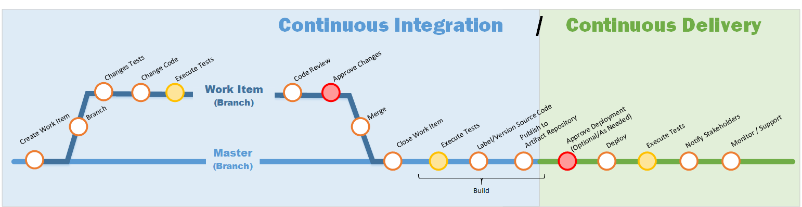

## What is Continuous Integration and Continuous Delivery

The diagram is meant to show at a high level the flow of a CI (Continuous Integration) / CD (Continuous Deployment) pipeline and provide guidance for your implementation.

**Continuous integration** establishes a consistent and automated way to apply code changes, test and package applications. Teams practicing continuous integration merge their changes back to the main branch as often as possible and changes are validated by running automated tests against the build. With automation and consistency in the process, teams commit code changes more frequently, which leads to better collaboration, software quality and avoid integration issues. Continuous integration puts a great emphasis on testing automation to check that the application is not broken whenever new commits are integrated into the main branch.

**Continuous delivery** is an extension of continuous integration to make sure that you can release new changes, meaning the artifact packaged in CI, to your customers quickly in a sustainable way. This means that on top of having automated your testing, you also have automated your release process and you can deploy your application at any point of time by clicking on a button to your environments, including production.

**Continuous deployment** goes one steps further then continuous delivery as it removes any human intervention in the process. In this practice every change that passes all stages of your production pipeline is released to your customers therefore maturity, rigor and discipline is required for its implementation.

Modern tools, such as Azure DevOps and GitLab, support CI/CD pipelines with slight variations in their implementation, terminology and may combine some of the steps described in this document. These tools help you implement and manage your pipeline and help you automate many of the steps discussed. The pipeline is executed in a sequence and therefore a step needs to be satisfied before moving to the next step.

The diagram shows 3 opportunities for testing which could include but not limited to the following types of testing: • Code Quality • Unit Tests • Integration • Regression • End to End Tests • Accessibility • Security • Performance • Formatting Standards • Code Linting • Variable scoping • Secrets Management • Common Vulnerability Exposures • License Compliance • Connectivity

The pipeline has 2 approval steps that would be defined by your team and partners.

The success of your pipeline will depend on the implementation and maturity of each of these steps. Each steps should be an opportunity for your team to question current practices, improve on them and favor automation.

## Pipeline Steps

### Create Work Item

* First step of CI
* Any change to the code should start with a work item
* Work items can represent a defect or an enhancement request
* Having a reason for every code change helps to inform the rest of the team, describes the goal of the change and keeps the scope small

### Branch

* Any change to code should be done in isolation in a separate branch from your "Master" branch
* Branches should be short lived and merged back into your "Master" branch as early as possible
* _Notes:_
  * "Master" branch refers to your main branch where your latest committed code is stored. In a mature CI/CD implementation       the code in this branch would be the same as being executed in production.
  * This document is not meant to provide branching strategies, but to enforce that all code changes need to be performed on a branch other then "Master" and that a build should only be done from the "Master" branch, forcing your changes to be merged to the "Master" branch.

### Change Tests

* All tests must be automated
* Any change to code should require modifications to existing tests and possibly require tests to be created
* Test data and mocking may require modifications or be created
* Following Test Driven Development, tests would be created first (initially failing) to test the desired outcome. Minimal changes to code would then be made to satisfy the tests.
* Tests to modify or create may include but not limited to: Unit Tests, security tests, integration tests etc…

### Change Code

* Changes to the source code are made to meet the desired outcome
* Changes should follow your best practices
* The creation of mock objects may be included in this step

### Execute Tests

* Tests are executed automatically on code commits
* All tests modified or created are executed
* All other tests deemed necessary are executed
* Adjustments to code and/or tests may be required and are addressed at this point
* Tests at this stage focus on but not limited to:  
  * Quality of the code
  * Functionality (existing and newly introduced)
  * Security

### Code Review

* Is a quality assurance step where one or several peers review the changes
* The author of the changes should not be a reviewer but is a recipient of the comments/feedback for them to learn and improve
* Any suggested changes can be performed by either the author or the reviewers

### Approve Changes

* Checkpoint to enforce the quality of each step before the changes are committed into the "Master" branch
* The approval process is defined by your team

### Merge

* A merge is triggered by the approval of changes
* After all checkpoints are met, the code changes are merged to the "Master" branch in preparation for the build
* The branch created to perform the changes can be removed
* Any merge conflicts are addressed at this point

### Close Work Item

* The work item that was created at the start of the pipeline can now be closed
* Ensure necessary information and comments are included

### Build

* A build is triggered by the merge to "Master" branch
* Builds should only be performed from the master branch
* It will retrieve the latest version of the source code from the master branch and compile it
* The result is an artifact

### Build - Execute Tests

* The successful build of the artifact triggers the execution of the tests
* All necessary tests should be executed
* The step is complete once all tests pass successfully
* Tests at this stage focus on but not limited to:  
  * Functionality (existing and newly introduced)
  * Security
  * Integration
* Adjustments to code and/or tests maybe required and are addressed at this point

### Build - Label/Version Source Code

* A successful execution of the tests triggers labeling the changes to provide a snapshot of the source code at a given time
* This can be used to:  
  * Compare past changes
  * Return to a certain state of your source code

### Build - Publish to Artifact Repository

* Last step of CI
* Following the labeling the built artifact is published to the artifact repository
* Outcome is an artifact ready for deployment

### Approve Deployment (Optional)

* First step of CD
* This checkpoint is optional and is meant to give flexibility to the teams and let you determine if the approval is required or not for a particular environment. Example: non-production environments may not require an approval step, but Production may require the business partner to approve the deployment.
* The approval process is defined by your team and your business partner

### Deploy

* In continuous delivery the deployment is triggered either by the optional approval process or by human intervention. In continuous deployment the deployment is triggered by the successful build.
* Once started the deployment should be automated and there shouldn't be a need for human intervention
* This step involves taking an artifact from the artifact repository and deploying it to a particular environment
* The deployment can include installing the artifact, dependencies and configuration to the environment
* The deployment process is defined by your team and could target 1 environment or multiple environments sequentially (INT, TST, UAT, PERF, Staging...)

### Execute Tests (_Again_)

* The successful deployment triggers the execution of the tests
* Tests ensure the deployed artifact is behaving as expected
* Tests at this stage focus on but not limited to:
  * Security
  * Integration
  * Connectivity

### Notify Stakeholders

If required, the notification is triggered by the successful deployment and execution of tests

### Monitor/Support

* Last stage of CD
* Monitor the health of the solution
* Provide support as needed

## References

[Continuous Integration and Continuous Delivery Explained](https://www.infoworld.com/article/3271126/what-is-cicd-continuous-integration-and-continuous-delivery-explained.html)

[Continuous Integration vs Delivery vs Deployment](https://www.atlassian.com/continuous-delivery/principles/continuous-integration-vs-delivery-vs-deployment)

[Introduction to GitLab Flow](https://docs.gitlab.com/ee/workflow/gitlab_flow.html)
