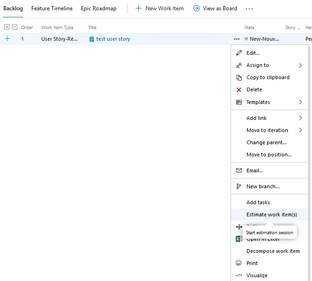
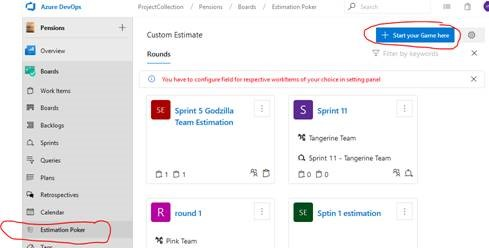
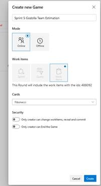
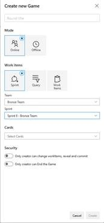
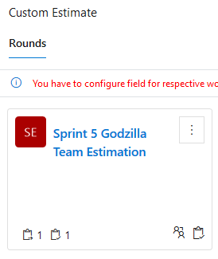
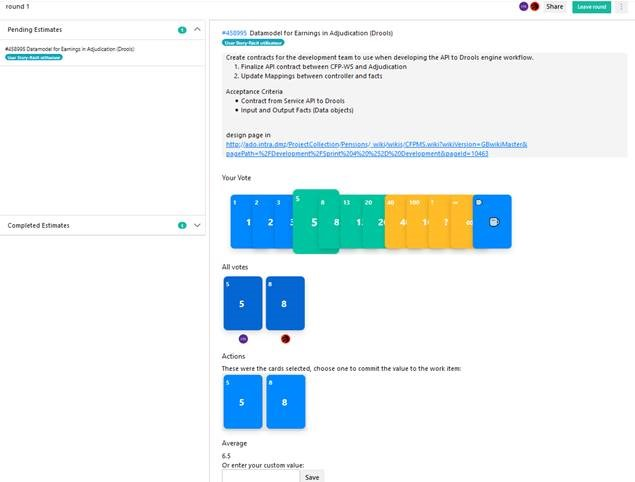

*Le texte français est donné à la suite.*

## Create a new Estimation Game

* Opt 1: From a board, click the “…” beside your work item, select “Estimate work item(s)”
* Opt 2: From the left menu, select “Boards/Estimation Poker”, and then “+Start your Game here”

### Configure your Game

* Enter a “Title” for your game
* Select “Online” to view the estimations from your team real-time
* Additional items may appear depending on how you started your game. Ex: select Team and sprint, select query…
* Select the type of estimation you want to use (T-Shirt sizes, Fibonacci…) through the “Cards” field
* Click “Create”
* This will create a new game on the “Estimation Poker” hub

### Invite your team members to the game

* From the left menu, select “Boards/Estimation Poker”, and then Select the game

### Estimate

* Pick the Work Item to estimate from the “Pending Estimates” section
* Have your team members vote by selecting a card under “Your Vote” section
* Once all votes are in, click “Reveal”
* Reach consensus on the estimation, you can re-vote if necessary

### Select the final estimation for your work item to be updated

* Once consensus is reached, select the final card/estimation under “Actions” section
* This will update the “Story Points | Points du récit:” field of your work item

### Repeat with your next work items

---
*Texte français:*

### Créer un nouveau jeu d'estimation

* Option 1: À partir d'un tableau, cliquez sur «…» à côté de votre élément de travail, sélectionnez «Estimate work item(s)»
* Option 2: Dans le menu de gauche, sélectionnez «Boards / Estimation Poker», puis «+ Start your Game here»

### Configurez votre jeu

* Saisissez un «Title» pour votre jeu
* Sélectionnez «Online» pour afficher les estimations de votre équipe en temps réel
* Des éléments supplémentaires peuvent apparaître selon la façon dont vous avez commencé votre jeu. Ex: sélectionnez Équipe et sprint, sélectionnez requête…
* Sélectionnez le type d'estimation que vous souhaitez utiliser (T-shirts, Fibonacci…) via le champ «Cards»
* Cliquez sur «Create»
* Cela créera un nouveau jeu sur le hub «Estimation Poker»

### Invitez les membres de votre équipe au jeu

* Dans le menu de gauche, sélectionnez «Boards / Estimation Poker», puis sélectionnez le jeu

### Estimation

* Sélectionnez l'élément de travail à estimer dans la section «Pending Estimates»
* Demandez aux membres de votre équipe de voter en sélectionnant une carte dans la section «Your Vote»
* Une fois tous les votes enregistrés, cliquez sur «Reveal»
* Parvenez à un consensus sur l'estimation, vous pouvez voter à nouveau si nécessaire

### Sélectionnez l'estimation finale pour votre élément de travail à mettre à jour

* Une fois le consensus atteint, sélectionner la carte / estimation finale dans la section «Actions»
* Cela mettra à jour le «Story Points | Points du récit:» champ de votre élément de travail

### Répétez avec vos prochains éléments de travail
