## Links for Accessibility testing Browser extensions

### Accessibility Insights

To request to have Insights for **Windows** installed on your desktop from the NSD Application Catalogue:

- Navigate to [NSD](https://iservice.prv/eng/imit/nsd/index.shtml "NSD")
- From the **Application Catalogue**, click the **Commercial Software** tab, then select the *Accessibility Insights for Windows* link and click *Install*.
- The installation should take approximately 2 days.  

Add the [Accessibility Insights Browser Extension](https://accessibilityinsights.io/downloads/ "Accessibility Insights Browser Extension") directly within your browser (for Chrome and Edge):

[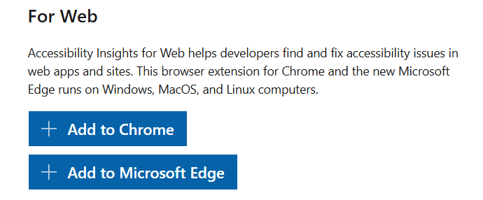](../assets/a11y-web-extensions/Insights_1.png)

[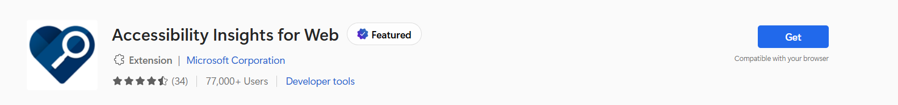](../assets/a11y-web-extensions/Insights_2.png)

[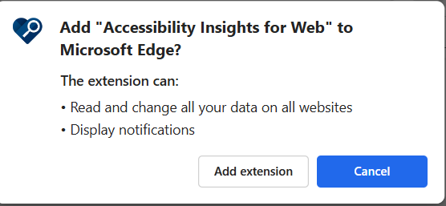](../assets/a11y-web-extensions/Insights_3.png)

[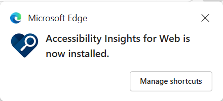](../assets/a11y-web-extensions/Insights_4.png)

### WAVE

Add the [WAVE Browser Extension](https://wave.webaim.org/extension/ "WAVE Browser Extension") directly within your browser (for Chrome, Edge, Firefox):

[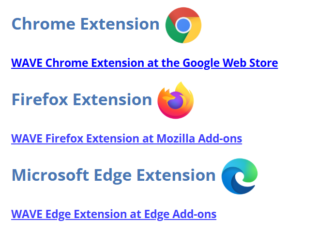](../assets/a11y-web-extensions/WAVE_2.png)

[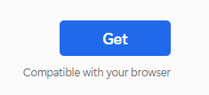](../assets/a11y-web-extensions/WAVE_3.png)

[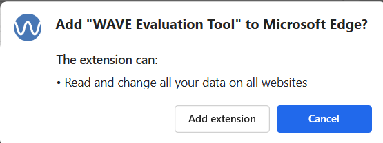](../assets/a11y-web-extensions/WAVE_4.png)

[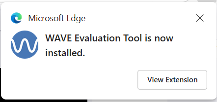](../assets/a11y-web-extensions/WAVE_5.png)

### Axe Dev Tools

Add the [Axe DevTools Browser Extension](https://www.deque.com/axe/devtools/extension/ "Axe DevTools Browser Extension") directly within your browser (for Chrome, Edge, Firefox):

[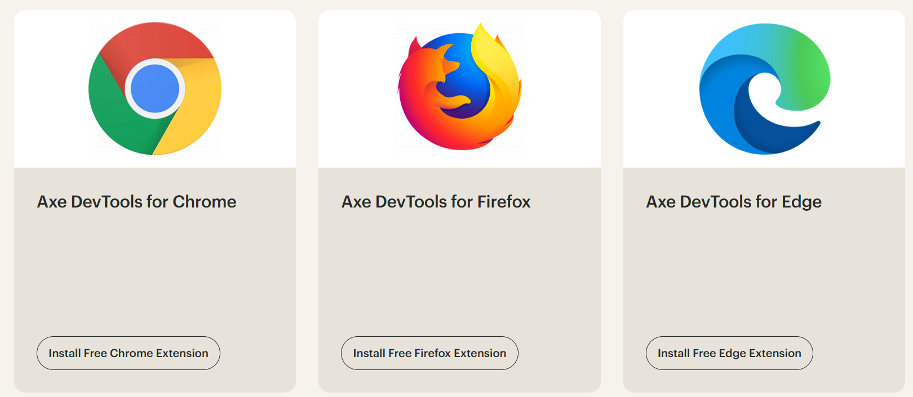](../assets/a11y-web-extensions/Axe_1_Note_ScrollToBottomOfPage.png)

[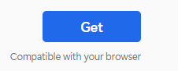](../assets/a11y-web-extensions/Axe_2.png)

[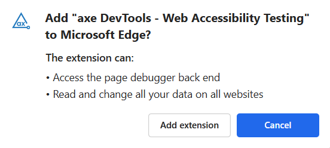](../assets/a11y-web-extensions/Axe_3.png)

[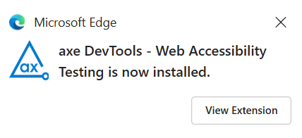](../assets/a11y-web-extensions/Axe_4.png)

### W3C HTML validation

Add your HTML source code directly to the **Validate by Direct Input** field in the [W3C Markup Validation Service](https://validator.w3.org/#validate_by_input "W3C Markup Validation Service"), to validate HTML compliance:

[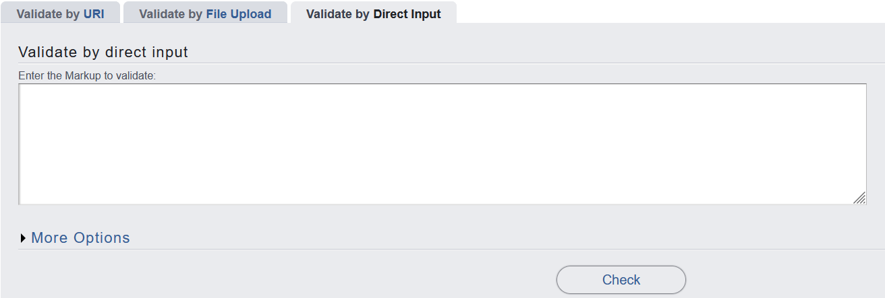](../assets/a11y-web-extensions/W3C-html-validator.png)
