*Le texte français est donné à la suite.*

## Links for Accessibility testing Browser extensions

### Accessibility Insights

To request to have Insights for **Windows** installed on your desktop from the NSD Application Catalogue:

- Navigate to [NSD](https://iservice.prv/eng/imit/nsd/index.shtml "NSD")
- From the **Application Catalogue**, click the **Commercial Software** tab, then select the *Accessibility Insights for Windows* link and click *Install*.
- The installation should take approximately 2 days.  

Add the [Accessibility Insights Browser Extension](https://accessibilityinsights.io/downloads/ "Accessibility Insights Browser Extension") directly within your browser (for Chrome and Edge):

[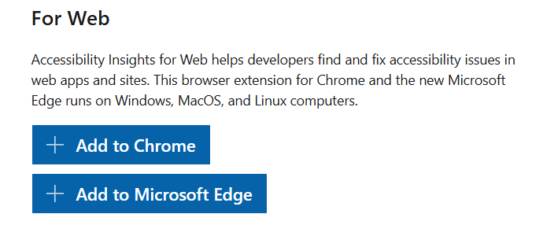](../assets/a11y-web-extensions/Insights_1.png)

[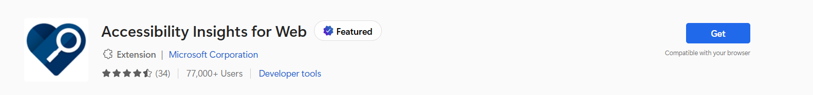](../assets/a11y-web-extensions/Insights_2.png)

[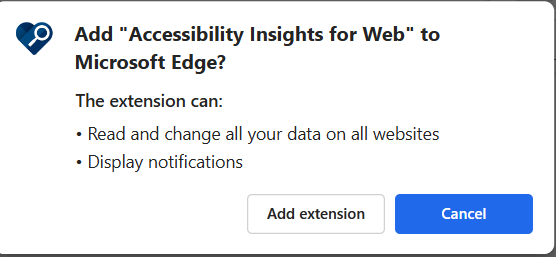](../assets/a11y-web-extensions/Insights_3.png)

[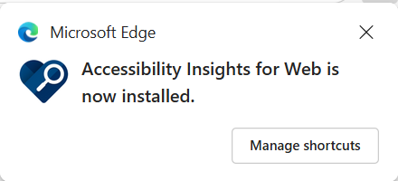](../assets/a11y-web-extensions/Insights_4.png)

### WAVE

Add the [WAVE Browser Extension](https://wave.webaim.org/extension/ "WAVE Browser Extension") directly within your browser (for Chrome, Edge, Firefox):

[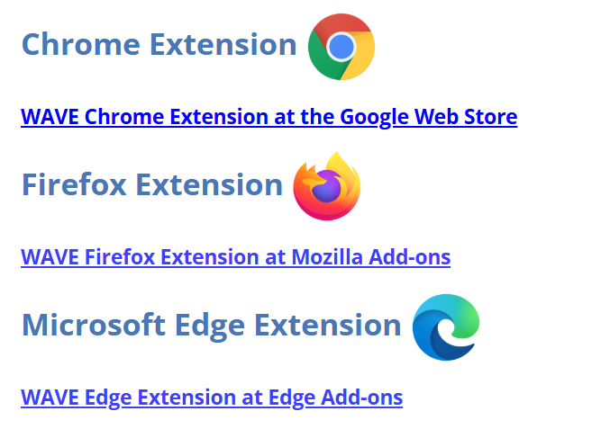](../assets/a11y-web-extensions/WAVE_2.png)

[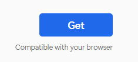](../assets/a11y-web-extensions/WAVE_3.png)

[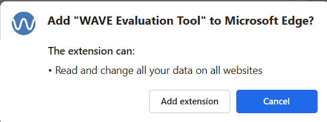](../assets/a11y-web-extensions/WAVE_4.png)

[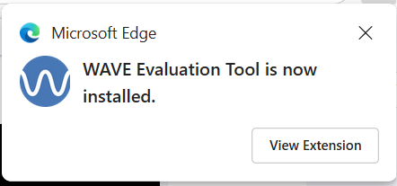](../assets/a11y-web-extensions/WAVE_5.png)

### Axe Dev Tools

Add the [Axe DevTools Browser Extension](https://www.deque.com/axe/devtools/extension/ "Axe DevTools Browser Extension") directly within your browser (for Chrome, Edge, Firefox):

[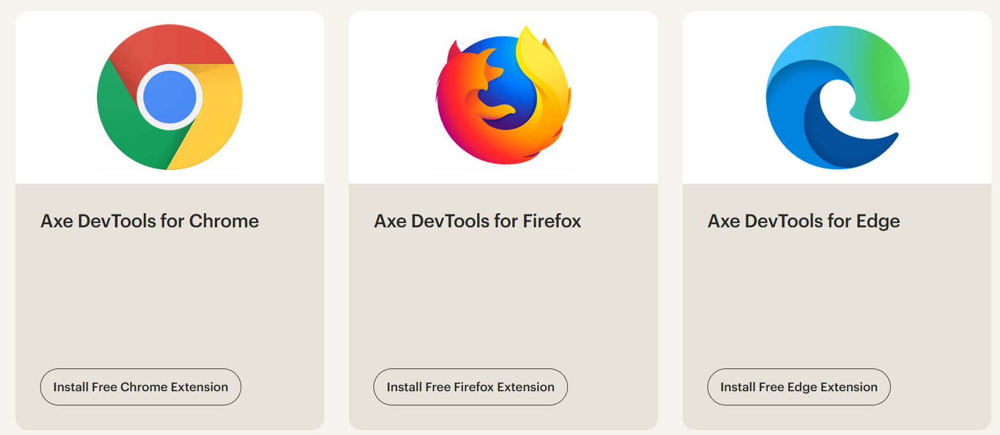](../assets/a11y-web-extensions/Axe_1_Note_ScrollToBottomOfPage.png)

[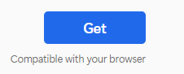](../assets/a11y-web-extensions/Axe_2.png)

[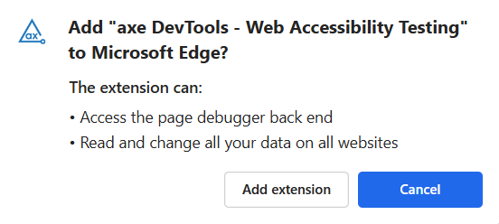](../assets/a11y-web-extensions/Axe_3.png)

[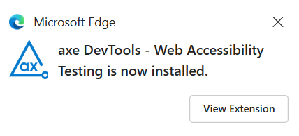](../assets/a11y-web-extensions/Axe_4.png)

### W3C HTML validation

Add your HTML source code directly to the **Validate by Direct Input** field in the [W3C Markup Validation Service](https://validator.w3.org/#validate_by_input "W3C Markup Validation Service"), to validate HTML compliance:

[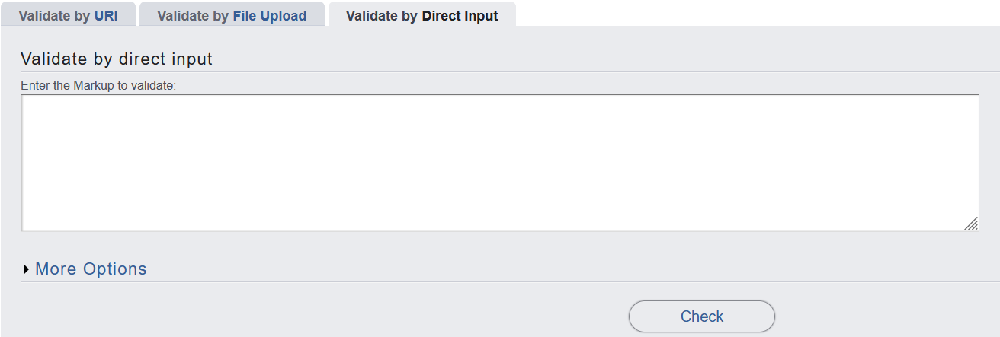](../assets/a11y-web-extensions/W3C-html-validator.png)

---

*Texte français:*

### Liens pour les extensions de navigateur de test d'accessibilité

<!-- markdownlint-disable MD024 -->
#### Accessibility Insights
<!-- markdownlint-enable MD024 -->

Pour demander l'installation d'Insights pour **Windows** sur votre poste de travail à partir du catalogue d'applications NSD :

- Accédez à [NSD](https://iservice.prv/eng/imit/nsd/index.shtml "NSD")
- Dans le **Catalogue d'applications**, cliquez sur l'onglet **Logiciels commerciaux**, puis sélectionnez le lien *Accessibility Insights for Windows* et cliquez sur *Installer*.
- L'installation devrait prendre environ 2 jours.

Ajoutez l'[extension de navigateur Accessibility Insights](https://accessibilityinsights.io/downloads/ "Extension de navigateur Accessibility Insights") directement dans votre navigateur (pour Chrome et Edge) :

<!-- markdownlint-disable MD024 -->
#### WAVE
<!-- markdownlint-enable MD024 -->

Ajoutez l'[extension de navigateur WAVE](https://wave.webaim.org/extension/ "Extension de navigateur WAVE") directement dans votre navigateur (pour Chrome, Edge, Firefox) :

<!-- markdownlint-disable MD024 -->
#### Axe Dev Tools
<!-- markdownlint-enable MD024 -->

Ajoutez l'[extension de navigateur Axe DevTools](https://www.deque.com/axe/devtools/extension/ "Extension de navigateur Axe DevTools") directement dans votre navigateur (pour Chrome, Edge, Firefox) :

#### Validation HTML du W3C

Ajoutez votre code source HTML directement dans le champ **Validate by Direct Input** du [service de validation du balisage du W3C](https://validator.w3.org/#validate_by_input "Service de validation du balisage du W3C"), pour valider la conformité HTML :

