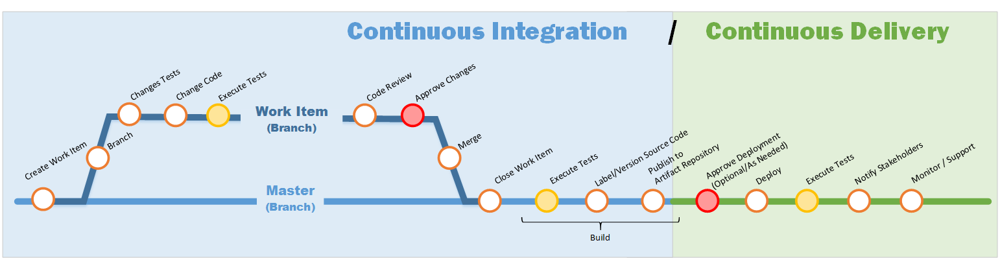

*Le texte français est donné à la suite.*

## What is Continuous Integration and Continuous Delivery

The diagram is meant to show at a high level the flow of a CI (Continuous Integration) / CD (Continuous Deployment) pipeline and provide guidance for your implementation.

**Continuous integration** establishes a consistent and automated way to apply code changes, test and package applications. Teams practicing continuous integration merge their changes back to the main branch as often as possible and changes are validated by running automated tests against the build. With automation and consistency in the process, teams commit code changes more frequently, which leads to better collaboration, software quality and avoid integration issues. Continuous integration puts a great emphasis on testing automation to check that the application is not broken whenever new commits are integrated into the main branch.

**Continuous delivery** is an extension of continuous integration to make sure that you can release new changes, meaning the artifact packaged in CI, to your customers quickly in a sustainable way. This means that on top of having automated your testing, you also have automated your release process and you can deploy your application at any point of time by clicking on a button to your environments, including production.

**Continuous deployment** goes one steps further then continuous delivery as it removes any human intervention in the process. In this practice every change that passes all stages of your production pipeline is released to your customers therefore maturity, rigor and discipline is required for its implementation.

Modern tools, such as Azure DevOps and GitLab, support CI/CD pipelines with slight variations in their implementation, terminology and may combine some of the steps described in this document. These tools help you implement and manage your pipeline and help you automate many of the steps discussed. The pipeline is executed in a sequence and therefore a step needs to be satisfied before moving to the next step.

The diagram shows 3 opportunities for testing which could include but not limited to the following types of testing: • Code Quality • Unit Tests • Integration • Regression • End to End Tests • Accessibility • Security • Performance • Formatting Standards • Code Linting • Variable scoping • Secrets Management • Common Vulnerability Exposures • License Compliance • Connectivity

The pipeline has 2 approval steps that would be defined by your team and partners.

The success of your pipeline will depend on the implementation and maturity of each of these steps. Each steps should be an opportunity for your team to question current practices, improve on them and favor automation.

## Pipeline Steps

### Create Work Item

* First step of CI
* Any change to the code should start with a work item
* Work items can represent a defect or an enhancement request
* Having a reason for every code change helps to inform the rest of the team, describes the goal of the change and keeps the scope small

### Branch

* Any change to code should be done in isolation in a separate branch from your "Master" branch
* Branches should be short lived and merged back into your "Master" branch as early as possible
* _Notes:_
  * "Master" branch refers to your main branch where your latest committed code is stored. In a mature CI/CD implementation       the code in this branch would be the same as being executed in production.
  * This document is not meant to provide branching strategies, but to enforce that all code changes need to be performed on a branch other then "Master" and that a build should only be done from the "Master" branch, forcing your changes to be merged to the "Master" branch.

### Change Tests

* All tests must be automated
* Any change to code should require modifications to existing tests and possibly require tests to be created
* Test data and mocking may require modifications or be created
* Following Test Driven Development, tests would be created first (initially failing) to test the desired outcome. Minimal changes to code would then be made to satisfy the tests.
* Tests to modify or create may include but not limited to: Unit Tests, security tests, integration tests etc…

### Change Code

* Changes to the source code are made to meet the desired outcome
* Changes should follow your best practices
* The creation of mock objects may be included in this step

### Execute Tests

* Tests are executed automatically on code commits
* All tests modified or created are executed
* All other tests deemed necessary are executed
* Adjustments to code and/or tests may be required and are addressed at this point
* Tests at this stage focus on but not limited to:  
  * Quality of the code
  * Functionality (existing and newly introduced)
  * Security

### Code Review

* Is a quality assurance step where one or several peers review the changes
* The author of the changes should not be a reviewer but is a recipient of the comments/feedback for them to learn and improve
* Any suggested changes can be performed by either the author or the reviewers

### Approve Changes

* Checkpoint to enforce the quality of each step before the changes are committed into the "Master" branch
* The approval process is defined by your team

### Merge

* A merge is triggered by the approval of changes
* After all checkpoints are met, the code changes are merged to the "Master" branch in preparation for the build
* The branch created to perform the changes can be removed
* Any merge conflicts are addressed at this point

### Close Work Item

* The work item that was created at the start of the pipeline can now be closed
* Ensure necessary information and comments are included

### Build

* A build is triggered by the merge to "Master" branch
* Builds should only be performed from the master branch
* It will retrieve the latest version of the source code from the master branch and compile it
* The result is an artifact

### Build - Execute Tests

* The successful build of the artifact triggers the execution of the tests
* All necessary tests should be executed
* The step is complete once all tests pass successfully
* Tests at this stage focus on but not limited to:  
  * Functionality (existing and newly introduced)
  * Security
  * Integration
* Adjustments to code and/or tests maybe required and are addressed at this point

### Build - Label/Version Source Code

* A successful execution of the tests triggers labeling the changes to provide a snapshot of the source code at a given time
* This can be used to:  
  * Compare past changes
  * Return to a certain state of your source code

### Build - Publish to Artifact Repository

* Last step of CI
* Following the labeling the built artifact is published to the artifact repository
* Outcome is an artifact ready for deployment

### Approve Deployment (Optional)

* First step of CD
* This checkpoint is optional and is meant to give flexibility to the teams and let you determine if the approval is required or not for a particular environment. Example: non-production environments may not require an approval step, but Production may require the business partner to approve the deployment.
* The approval process is defined by your team and your business partner

### Deploy

* In continuous delivery the deployment is triggered either by the optional approval process or by human intervention. In continuous deployment the deployment is triggered by the successful build.
* Once started the deployment should be automated and there shouldn't be a need for human intervention
* This step involves taking an artifact from the artifact repository and deploying it to a particular environment
* The deployment can include installing the artifact, dependencies and configuration to the environment
* The deployment process is defined by your team and could target 1 environment or multiple environments sequentially (INT, TST, UAT, PERF, Staging...)

### Execute Tests (_Again_)

* The successful deployment triggers the execution of the tests
* Tests ensure the deployed artifact is behaving as expected
* Tests at this stage focus on but not limited to:
  * Security
  * Integration
  * Connectivity

### Notify Stakeholders

If required, the notification is triggered by the successful deployment and execution of tests

### Monitor/Support

* Last stage of CD
* Monitor the health of the solution
* Provide support as needed

## References

[Continuous Integration and Continuous Delivery Explained](https://www.infoworld.com/article/3271126/what-is-cicd-continuous-integration-and-continuous-delivery-explained.html )

[Continuous Integration vs Delivery vs Deployment](https://www.atlassian.com/continuous-delivery/principles/continuous-integration-vs-delivery-vs-deployment)

[Introduction to GitLab Flow](https://about.gitlab.com/topics/version-control/what-is-gitlab-flow/)

---

*Texte français:*

### Qu'est-ce que l'intégration continue et la livraison continue

Le diagramme vise à présenter à un niveau général le déroulement d'un pipeline CI (Intégration continue) / CD (Déploiement continu) et à guider votre mise en œuvre.

**L'intégration continue** établit une méthode cohérente et automatisée pour appliquer les modifications au code, tester et packager les applications. Les équipes qui pratiquent l'intégration continue fusionnent leurs modifications dans la branche principale le plus souvent possible, et les changements sont validés par l'exécution de tests automatisés lors de la compilation. Grâce à l'automatisation et à la cohérence du processus, les équipes publient des modifications de code plus fréquemment, ce qui améliore la collaboration, la qualité logicielle et évite les problèmes d'intégration. L'intégration continue met un accent particulier sur l'automatisation des tests pour s'assurer que l'application ne subit pas de régression lors de l'intégration de nouveaux commits dans la branche principale.

**La livraison continue** est une extension de l'intégration continue qui garantit la mise à disposition rapide et durable de nouveaux changements (c'est-à-dire l'artefact produit lors de la CI) aux utilisateurs. Cela signifie qu'en plus d'avoir automatisé vos tests, vous avez également automatisé votre processus de publication, et vous pouvez déployer votre application à tout moment en cliquant sur un bouton vers vos environnements, y compris la production.

**Le déploiement continu** va un cran plus loin que la livraison continue en supprimant toute intervention humaine du processus. Avec cette pratique, chaque modification réussissant toutes les étapes de votre pipeline de production est automatiquement mise à la disposition de vos utilisateurs; sa mise en œuvre exige donc maturité, rigueur et discipline.

Les outils modernes tels qu'Azure DevOps et GitLab prennent en charge les pipelines CI/CD avec de légères variations dans leur mise en œuvre et leur terminologie, et peuvent combiner certaines des étapes décrites dans ce document. Ces outils vous aident à implémenter et gérer votre pipeline ainsi qu'à automatiser nombre de ces étapes. Le pipeline est exécuté de manière séquentielle; chaque étape doit donc être validée avant de passer à la suivante.

Le diagramme illustre 3 occasions de tests qui peuvent inclure (sans s'y limiter) les types suivants : • Qualité du code • Tests unitaires • Intégration • Régression • Tests de bout en bout • Accessibilité • Sécurité • Performance • Normes de formatage • Analyse statique de code (Linting) • Portée des variables • Gestion des secrets • Vulnérabilités courantes (CVE) • Conformité des licences • Connectivité

Le pipeline comprend 2 étapes d'approbation définies par votre équipe et vos partenaires.

Le succès de votre pipeline dépendra de la mise en œuvre et de la maturité de chacune de ces étapes. Chaque étape devrait être une occasion pour votre équipe de réévaluer les pratiques courantes, de les optimiser et de privilégier l'automatisation.

### Étapes du pipeline

#### Créer un élément de travail

* Première étape de la CI
* Toute modification du code doit débuter par un élément de travail (work item)
* Les éléments de travail peuvent représenter une anomalie ou une demande d'amélioration
* Avoir une justification pour chaque modification informe le reste de l'équipe, clarifie l'objectif et permet de restreindre la portée du changement

#### Créer une branche

* Toute modification de code doit être effectuée de manière isolée dans une branche distincte de votre branche « Master »
* Les branches doivent être de courte durée et fusionnées dans la branche « Master » le plus tôt possible
* *Notes :*
  * La branche « Master » fait référence à votre branche principale où réside le code validé le plus récent. Dans une mise en œuvre mature de CI/CD, le code de cette branche est identique à celui exécuté en production.
  * Ce document n'a pas pour but de prescrire des stratégies de branches, mais de souligner que toute modification doit être réalisée sur une branche autre que « Master » et qu'une compilation ne doit être effectuée qu'à partir de la branche « Master », obligeant ainsi la fusion vers celle-ci.

#### Modifier les tests

* Tous les tests doivent être automatisés
* Toute modification de code doit s'accompagner d'une mise à jour des tests existants et éventuellement de la création de nouveaux tests
* Les données de test et les simulations (mocks) peuvent devoir être adaptées ou créées
* En suivant le développement piloté par les tests (TDD), les tests sont créés en premier (initialement en échec) pour valider le résultat attendu. Des modifications minimales de code sont ensuite apportées pour satisfaire les tests.
* Les tests à modifier ou créer comprennent notamment : tests unitaires, tests de sécurité, tests d'intégration, etc.

#### Modifier le code

* Les modifications apportées au code source visent à produire le résultat escompté
* Les modifications doivent respecter vos meilleures pratiques
* La création d'objets simulés (mocks) peut faire partie de cette étape

#### Exécuter les tests

* Les tests s'exécutent automatiquement lors de chaque commit
* Tous les tests modifiés ou créés sont exécutés
* Tous les autres tests jugés nécessaires sont exécutés
* Les ajustements au code ou aux tests peuvent être apportés à ce moment
* Les tests à cette étape se concentrent entre autres sur :
  * La qualité du code
  * La fonctionnalité (existante et nouvellement introduite)
  * La sécurité

#### Révision de code

* Étape d'assurance qualité où un ou plusieurs pairs examinent les modifications
* L'auteur des modifications ne doit pas être un réviseur, mais le destinataire des commentaires/rétroactions afin d'apprendre et de s'améliorer
* Toute modification suggérée peut être effectuée soit par l'auteur, soit par les réviseurs

#### Approuver les changements

* Point de contrôle pour garantir la qualité de chaque étape avant que les modifications ne soient intégrées à la branche « Master »
* Le processus d'approbation est défini par votre équipe

#### Fusionner

* La fusion est déclenchée par l'approbation des changements
* Une fois tous les points de contrôle satisfaits, les modifications de code sont fusionnées dans la branche « Master » en vue de la compilation
* La branche créée pour réaliser les modifications peut être supprimée
* Tout conflit de fusion est résolu à cette étape

#### Fermer l'élément de travail

* L'élément de travail créé au début du pipeline peut désormais être fermé
* Assurez-vous d'inclure les informations et commentaires nécessaires

#### Compiler (Build)

* La compilation est déclenchée par la fusion dans la branche « Master »
* Les compilations doivent uniquement être effectuées à partir de la branche principale
* Le processus récupère la version la plus récente du code source depuis la branche principale et le compile
* Le résultat est un artefact

#### Compiler - Exécuter les tests

* La création réussie de l'artefact déclenche l'exécution des tests
* Tous les tests requis doivent être exécutés
* L'étape est terminée dès que tous les tests réussissent
* Les tests à cette étape ciblent notamment :
  * La fonctionnalité (existante et nouvellement introduite)
  * La sécurité
  * L'intégration
* Les ajustements au code ou aux tests peuvent être effectués à cette étape au besoin

#### Compiler - Étiqueter / Versionner le code source

* L'exécution réussie des tests déclenche l'étiquetage (tagging/labeling) pour figer un instantané du code source à un moment précis
* Cela permet de :
  * Comparer les versions antérieures
  * Revenir à un état précis du code source

#### Compiler - Publier dans le référentiel d'artefacts

* Dernière étape de la CI
* Après l'étiquetage, l'artefact compilé est publié dans le référentiel d'artefacts
* Le résultat est un artefact prêt pour le déploiement

#### Approuver le déploiement (Optionnel)

* Première étape de la CD
* Ce point de contrôle est facultatif et offre une flexibilité aux équipes pour décider si une approbation est requise pour un environnement donné. Par exemple : les environnements hors production peuvent ne pas exiger d'approbation, tandis que la production peut nécessiter l'approbation du partenaire d'affaires.
* Le processus d'approbation est défini par votre équipe et votre partenaire d'affaires

#### Déployer

* En livraison continue, le déploiement est déclenché soit par le processus d'approbation optionnel, soit par intervention humaine. En déploiement continu, le déploiement est déclenché automatiquement dès la fin de la compilation.
* Une fois lancé, le déploiement doit être automatisé sans nécessiter d'intervention humaine
* Cette étape consiste à récupérer un artefact du référentiel et à le déployer sur un environnement précis
* Le déploiement peut comprendre l'installation de l'artefact, de ses dépendances et de la configuration requise
* Le processus de déploiement est défini par votre équipe et peut viser 1 environnement ou plusieurs environnements séquentiellement (INT, TST, UAT, PERF, Staging...)

#### Exécuter les tests (*de nouveau*)

* Le déploiement réussi déclenche l'exécution des tests
* Les tests vérifient que l'artefact déployé fonctionne comme prévu
* Les tests à cette étape ciblent principalement :
  * La sécurité
  * L'intégration
  * La connectivité

#### Informer les parties prenantes

Au besoin, une notification est transmise automatiquement à la suite du déploiement et de l'exécution réussie des tests.

#### Surveillance et soutien

* Dernière étape de la CD
* Surveiller l'état de santé de la solution
* Fournir le soutien nécessaire

### Références

[Continuous Integration and Continuous Delivery Explained (en anglais)](https://www.infoworld.com/article/3271126/what-is-cicd-continuous-integration-and-continuous-delivery-explained.html)

[Continuous Integration vs Delivery vs Deployment (en anglais)](https://www.atlassian.com/continuous-delivery/principles/continuous-integration-vs-delivery-vs-deployment)

[Introduction to GitLab Flow (en anglais)](https://about.gitlab.com/topics/version-control/what-is-gitlab-flow/)
