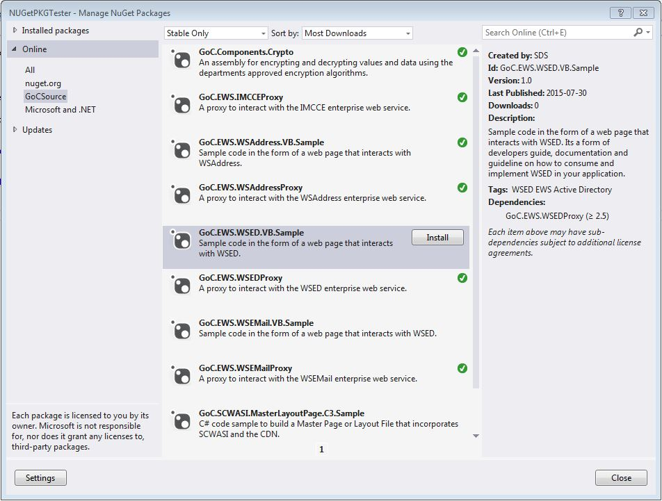

{{ page.summary }}

## Recommendation

**IMPORTANT: As of June 5th 2020, our (ESDC's) internal NuGet source (through JFrog Artifactory) has been removed.**

Packages can be stored and shared through other NuGet sources like:

* [nuget.org](https://www.nuget.org/)
* Azure DevOps Artifacts (self managed sources)

## URL for NuGet Source

* [https://api.nuget.org/v3/index.json](https://api.nuget.org/v3/index.json)

## How to add the alternate Sources to Visual Studio

* Open Visual Studio
* From the menu "Tools\Library Package Manager" select "Package Manager Settings"
* From the "Options" window, select "Package Manager\Package Sources"
* Click the "+" button
* Enter a name for the source to be added (ex: GoCSource)
* Enter the url of the alternate source
* Click "OK"

## How to view and install available packages

* Open a project in Visual Studios
* Right-click on the Project, and select "Manage NuGet Packages..."
* Select the internal source you added in the previous steps
* The list of available packages should be displayed in the center column and the description of the selected package will appear in the right column.
* Click the "Install" button to install this package into your project.
* What will this do?  
  * Add a "packages" folder at the top level of your projects folder
  * This "packages" folder holds the files required by the package
  * If dlls were included in the package, the reference to the dlls were added to your project
  * If config changes included in the package, your config file will be modified to include to entries
  * If the package has dependencies to other packages, those packages will also be installed

