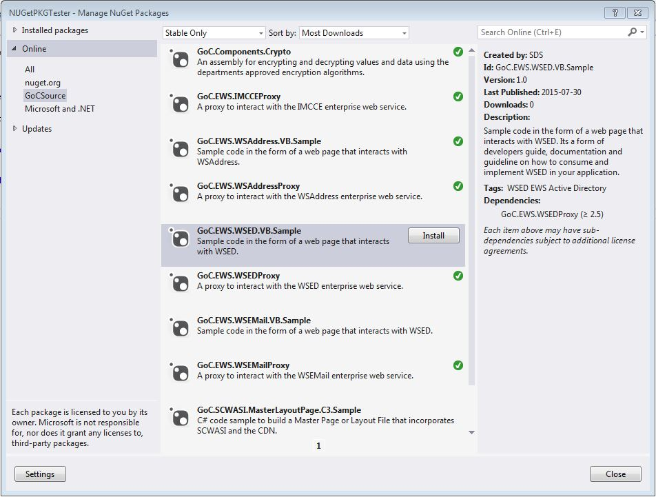

*Le texte français est donné à la suite.*

{{ page.summary }}

## Recommendation

**IMPORTANT: As of June 5th 2020, our (ESDC's) internal NuGet source (through JFrog Artifactory) has been removed.**

Packages can be stored and shared through other NuGet sources like:

* [nuget.org](https://www.nuget.org/)
* Azure DevOps Artifacts (self managed sources)

## URL for NuGet Source

* [https://api.nuget.org/v3/index.json](https://api.nuget.org/v3/index.json)

## How to add the alternate Sources to Visual Studio

* Open Visual Studio
* From the menu "Tools\Library Package Manager" select "Package Manager Settings"
* From the "Options" window, select "Package Manager\Package Sources"
* Click the "+" button
* Enter a name for the source to be added (ex: GoCSource)
* Enter the url of the alternate source
* Click "OK"

## How to view and install available packages

* Open a project in Visual Studios
* Right-click on the Project, and select "Manage NuGet Packages..."
* Select the internal source you added in the previous steps
* The list of available packages should be displayed in the center column and the description of the selected package will appear in the right column.
* Click the "Install" button to install this package into your project.
* What will this do?  
  * Add a "packages" folder at the top level of your projects folder
  * This "packages" folder holds the files required by the package
  * If dlls were included in the package, the reference to the dlls were added to your project
  * If config changes included in the package, your config file will be modified to include to entries
  * If the package has dependencies to other packages, those packages will also be installed

---

*Texte français:*

Comment configurer votre source Nuget dans Visual Studio

### Recommandation

**IMPORTANT : Depuis le 5 juin 2020, notre source NuGet interne d'EDSC (via JFrog Artifactory) a été retirée.**

Les paquets peuvent être hébergés et partagés via d'autres sources NuGet telles que :

* [nuget.org](https://www.nuget.org/)
* Azure DevOps Artifacts (sources auto-gérées)

### URL de la source NuGet

* [https://api.nuget.org/v3/index.json](https://api.nuget.org/v3/index.json)

### Comment ajouter des sources alternatives dans Visual Studio

* Ouvrez Visual Studio
* Dans le menu « Outils \ Gestionnaire de package de bibliothèque » (Tools\Library Package Manager), sélectionnez « Paramètres du gestionnaire de package »
* Dans la fenêtre « Options », sélectionnez « Gestionnaire de package \ Sources de package »
* Cliquez sur le bouton « + »
* Saisissez un nom pour la source à ajouter (ex. : GoCSource)
* Saisissez l'URL de la source alternative
* Cliquez sur « OK »

### Comment afficher et installer les paquets disponibles

* Ouvrez un projet dans Visual Studio
* Faites un clic droit sur le projet et sélectionnez « Gérer les packages NuGet... » (Manage NuGet Packages...)
* Sélectionnez la source interne ajoutée aux étapes précédentes
* La liste des paquets disponibles s'affiche dans la colonne centrale et la description du paquet sélectionné apparaît dans la colonne de droite.
* Cliquez sur le bouton « Installer » pour intégrer ce paquet à votre projet.
* Qu'est-ce que cela produit ?
  * Ajoute un dossier « packages » au niveau racine de votre dossier de projet
  * Ce dossier « packages » contient les fichiers requis par le paquet
  * Si des fichiers .dll sont inclus dans le paquet, les références vers ces dll sont ajoutées à votre projet
  * Si des modifications de configuration sont requises, votre fichier de configuration sera modifié pour inclure les entrées appropriées
  * Si le paquet a des dépendances vers d'autres paquets, ces derniers seront également installés

