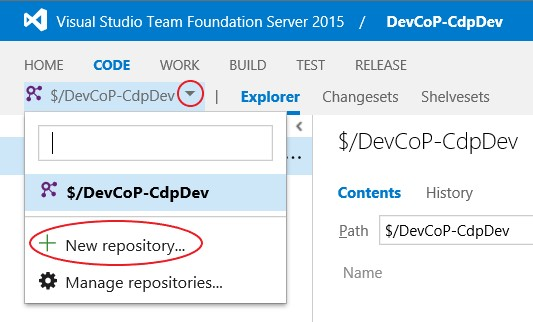
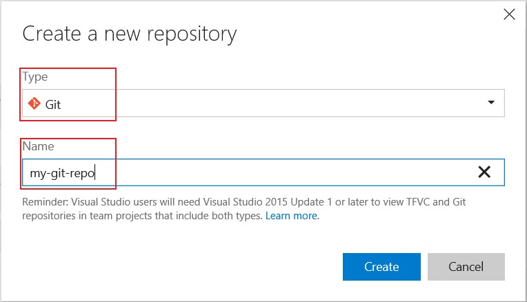
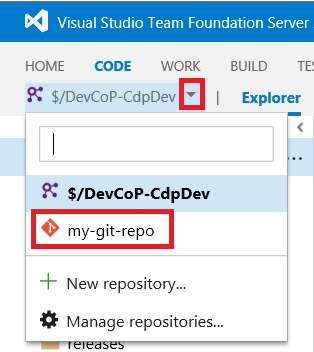
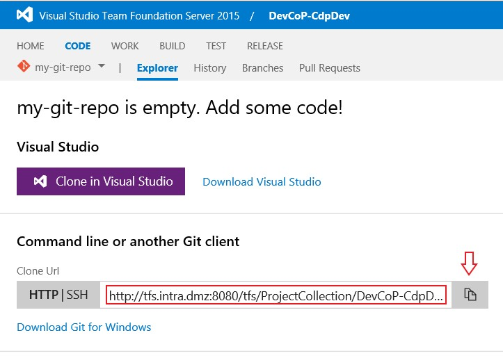
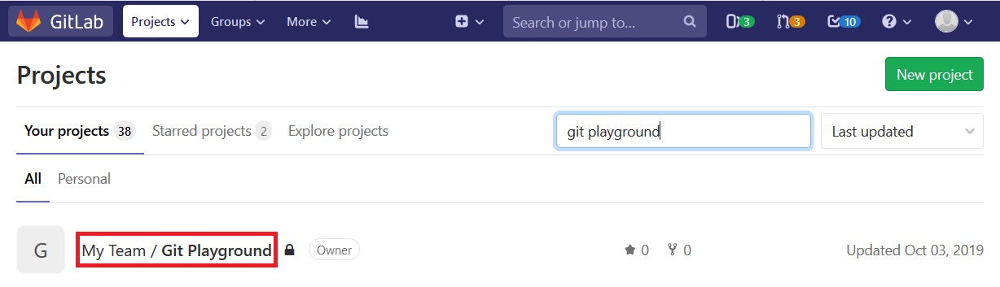
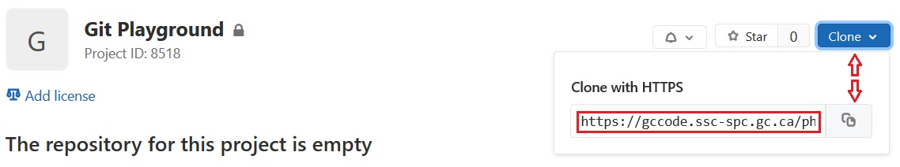
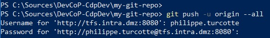

*Le texte français est donné à la suite.*

## Background

This guide outlines the steps required to migrate your repositories from
Microsoft's TFVC into Git-based repositories.

> **IMPORTANT :** Since TFS 2015 and Azure DevOps both support Git-based
> repositories, this doesn't force your teams to move away from them!

Here are the available Git hosting services:

* TFS 2015
* GCcode
* GitHub

## In this guide

1. [Prerequisites](#prerequisites)
1. [Create Remote Git Repository](#create-remote-git-repository)
1. [Clone TFVC to Local Git Repository](#clone-tfvc-to-local-git-repository)
1. [Connect to Remote Git Repository](#connect-to-remote-git-repository)
1. [Push to Remote Git Repository](#push-to-remote-git-repository)
1. [Additional Improvement](#additional-improvement)
1. [Further Reading](#further-reading)
1. [FAQ](#faq)

## Prerequisites

The prerequisites stay the same regardless of where you choose to host your Git repositories (TFS, GCcode or GitHub).

In order to migrate your TFVC repository into a Git repository you will need:

* **Install Git for Windows**:
  * Navigate to [NSD](https://iservice.prv/eng/imit/nsd/index.shtml "NSD")
  * From the **Application Catalogue**, click the **Commercial Software** tab, then select the *GIT* link and click *Install*.  
  * The installation should take approximately 2 days.  
  * or download it directly from [Git for Windows](https://gitforwindows.org/).
* **git-tfs**:
  * If you don't have it installed, download it from their [GitHub repository](https://github.com/git-tfs/git-tfs). ([direct link](https://github.com/git-tfs/git-tfs/releases/download/v0.30/GitTfs-0.30.0.zip))
  * To install `git-tfs`, extract the content of the ZIP file to a folder
  (i.e. `C:\git-tfs`) and add that folder's location to the `PATH` system
  environment variables.
* **Permissions to create repositories in target Git hosting service**:
  * If you don't have the appropriate permissions, request them from your
  team's source control administrator or request that a new Git repository
  to be created.

## Create Remote Git Repository

First up, you will need to create a new Git repository in your Git hosting
service (TFS 2015, GCcode or GitHub).

The process will be different depending on the hosting service selected by your
team. However, it remains simple and effortless as long as you have the
appropriate permissions to create repositories.

### Create Remote Git Repository in TFS

1. Open the web portal for your TFS team project in a browser.
1. Navigate to the `CODE` section using the navbar.
1. Open the list of repositories by clicking the small *down arrow* ↓ beside your TFVC repository.
1. Click `+ New repository...`.

    

1. By default, Git should already be selected as the `Type`. If not, pick `Git` from the list.
1. Enter the name of your new Git repository. (i.e. `my-git-repo`)

    

1. Finally, click `Create`.

### Create Project in GCcode

1. Open [GCcode](https://gccode.ssc-spc.gc.ca/) in a browser.
1. On the right side of the navbar, click the `+ (New)` menu and select `New project`.

    

1. Enter the name of your new project (i.e. `Git Playground`). This will
automatically fill out the `Project slug`. The project slugs are *URL-friendly*
versions of project names.
1. Pick your team's GCcode project for the `Project URL` field.
1. Select the appropriate level of visibility for the project.

    > **IMPORTANT :** Keep in mind that GCcode is only accessible on the Government of
    > Canada network. Therefore, `Public` means available to other departments and
    > agencies. For more information about visibility, see "[Subgroups - internal organizations](https://gccode.ssc-spc.gc.ca/help/user/group/subgroups/index.md)".

1. Finally, click `Create project`.

### Create Project in GitHub

*Steps will be added shortly.*

## Clone TFVC to Local Git Repository

1. Open a `PowerShell` terminal.
1. Create a folder for your local repositories (i.e. `C:\sources`) and navigate
into that folder.

    ```batch
    mkdir c:\sources
    cd c:\sources
    ```

1. Download the latest Visual Studio `.gitignore` template from GitHub into this
folder. A `.gitignore` file specifies intentionally untracked files that Git
should ignore. To read more about `.gitignore` files, see [Ignoring Files](https://git-scm.com/book/en/v2/Git-Basics-Recording-Changes-to-the-Repository#_ignoring) of the [Pro Git](https://git-scm.com/book/en/v2) book.

    ```bash
    Invoke-WebRequest -Uri https://raw.githubusercontent.com/github/gitignore/master/VisualStudio.gitignore
    -UseBasicParsing -OutFile .gitignore
    ```

1. Add patterns to match files, folders or branches from your TFVC repository in
TFS that should be ignored during this migration process. Good candidates for
this include any installers, archived release branches, etc. To read more about
the patterns to match items, see [Git ignore patterns](https://www.atlassian.com/git/tutorials/saving-changes/gitignore#git-ignore-patterns) from Atlassian.

    ```bash
    dev-tools-installers/
    releases/
    ```

1. Create a folder to clone your Git repository into (i.e.
`C:\sources\my-git-repo`) and navigate into that folder.

    ```batch
    mkdir c:\sources\my-git-repo
    cd c:\sources\my-git-repo
    ```

1. Clone your TFVC repository from TFS to a local Git repository. Don't forget
to specify the `.gitignore` file that you copied earlier!

    ```bash
    git tfs quick-clone "https://ado.intra.dmz/ProjectCollection/" "$/DevCoP-CdpDev" . --gitignore="c:\sources\.gitignore"
    ```

    > **IMPORTANT :** There is a bug with the latest version of the
    > `libgit2/libgit2sharp` library being used by `git-tfs` which reports an
    > unhandled `System.AccessViolationException` exception. However, this is thrown
    > during the clean-up phase after the migration which doesn't affect the clone
    > process. You can read more about this on the [issue page](https://github.com/git-tfs/git-tfs/issues/1281)
    > for this bug.

1. Add a `.gitignore` file at the root for your solution.

    ```bash
    Invoke-WebRequest -Uri https://raw.githubusercontent.com/github/gitignore/master/VisualStudio.gitignore
    -UseBasicParsing -OutFile .gitignore
    ```

1. Remove secrets or encrypt as necessary.

## Connect to Remote Git Repository

In order to push your local repository to your selected Git hosting service, it
needs to know *where* the remote repository is located. This is done by adding
a `remote` in with a Git command. To read more about remotes, see [Working with Remotes](https://git-scm.com/book/en/v2/Git-Basics-Working-with-Remotes) from the [Pro Git](https://git-scm.com/book/en/v2) book.

The following steps will help you find the URL to your remote Git repository.

### Copy remote repository URL in TFS

1. Open the web portal for your TFS team project in a browser.
1. Navigate to the `CODE` section using the navbar.
1. Open the list of repositories by clicking the small *down arrow* ↓ beside
your TFVC repository.
1. Navigate to your project's page by clicking on its name.

    

1. Click the `Copy to clipboard` button.

    

### Copy remote repository URL in GCcode

1. Open [GCcode](https://gccode.ssc-spc.gc.ca/) in a browser.
1. Filter the projects to find the one your are looking for.
1. Navigate to your project's page by clicking on its name.

    

1. Click the `Clone` button on the right side of the screen.
1. Click the `Copy URL to clipboard` button.

    

### Copy remote repository URL in GitHub

*Steps will be added shortly.*

### Connect local Git repository to remote Git repository.

1. Use the URL that you copied from the previous section to connect your local
repository to the remote one.

    ```bash
    git remote add origin "https://ado.intra.dmz/ProjectCollection/DevCoP-CdpDev/_versionControl"
    ```

## Push to Remote Git Repository

1. Push local Git repository into remote Git repository.

    ```bash
    git push --all origin
    ```

1. Enter your Windows credentials as requested. If you make a typo, simply press
`CTRL + C` to cancel the command and try again.

    

    > **TIP :** Press the *up arrow* ↑ to bring back the last command from the
    > terminal's history.

## Additional Improvement

### Productivity tips for your repository.

* Add Git [Templates files](https://github.com/canada-ca/template-gabarit) to
the Repository
* Add labels with the [ESDC Label Generator](https://github.com/esdc-edsc/label-generator)
(for GCcode & GitHub)

## Further Reading

### Learn about Git

* [Git documentation](https://git-scm.com/doc)
* [Learn Git branching](https://learngitbranching.js.org/)

### Similar Guides

* [TFS to GCcode](tfs-to-gccode)

## FAQ

### Is it possible to migrate the code changeset history from TFSV to Git?

> Did you succeeded?
> Should we do that?

It is possible, and we have successfully done it a few times.
You can use the [GitTFS tool](https://github.com/git-tfs/git-tfs/blob/master/doc/usecases/migrate_tfs_to_git.md).

There is no legal requirements for us to keep source code history, therefore we do not recommend keeping any history in the conversion.
We don't see any value in keeping it because the code is the truth of how the project functions currently (features and bugs included).
If something needs to be changed, it still needs to be changed whether it was codded a specific way in the past for a reason or not.
If the team still is set on keeping history, we suggest you only keep history going back one release, as the conversion will take a very long time.

### Would you recommend to use the Wiki functionality for replacing our current SPECS document using MS Word?

> I saw multiples interesting functionalities like the ReadMe.md (i.e.: for the file project configuration) and the Wiki section in markdown.  
> Personally, I see a lot of pros to use GitLab.
> Centralize everything, any docs at the same place.

**Absolutely!!**

All documentation should be, at a minimum, moved into source control.
This allows you to version your documentation with the code it's documenting.
Taking it a step further to change your documentation to markdown is even better.
That will allow you to track changes through your documentation, and allow you to begin to automate the documentation.

Wikis should be used to document client or user information while documentation related to development or deployments should be kept with the source code itself.
You should also feel free to not use the *Wiki* itself at all, if all the documentation is in the source control.
If you are not using a Wiki, any client or user documentation should be published to a website;
[GitLab Pages](https://about.gitlab.com/product/pages/) and [GitHub Pages](https://pages.github.com/) are both great services to host this type of documentation.

### What are the real benefits of using Git into a long term perspective?

> Actually, we are working with TFS and everything works fine.
> Why should we move to Git?
> What are the real benefit in short term and long term?

Even if Git is hard to start with at the begining, there is so much pro in short and long term.

#### The branching model

* Creating/Switch branch in Git takes miliseconds/seconds rather than minutes/hours in TFSV
* The complete repository is stored locally on your computer so you dont have any dependencies on the Network.
* It's so easy to work with branch that you can literaly create much you want and isolate every code change or features.
* The merge tool is a way more better in Git rather than TFSV. There is less merge conflict in Git due to a strong 3 ways merge mechanism.
* Every Git platforms contains a Pull Request feature that allow every one to collaborate and share knowledge about an isolate code change or feature.
* You don't have to check-out explicitly any changes. Everything is tracked by Git automatically.

#### Communuties and third party tools

* Git is the most used source version control tool in the world.
* You have a large community.
* All the new popular third party tools are designed based on Git.
* Even **Microsoft** made the switch. Git is now the default source control system in TFS/Azure DevOps. They also maintain the entire .NET framework on [GitHub](https://github.com/dotnet) as an open source project.
* Even if you are using TFS(or Azure DevOps), GitHub, GitLab, Jira, etc. You can use Git as official source code version control system.

---

*Texte français:*

### Contexte

Ce guide décrit les étapes requises pour migrer vos référentiels depuis TFVC de Microsoft vers des référentiels Git.

> **IMPORTANT :** Étant donné que TFS 2015 et Azure DevOps prennent tous deux en charge les référentiels Git, vos équipes ne sont pas obligées de quitter ces plateformes !

Voici les services d'hébergement Git disponibles :

* TFS 2015
* GCcode
* GitHub

### Dans ce guide

1. [Prérequis](#prérequis)
1. [Créer un référentiel Git distant](#créer-un-référentiel-git-distant)
1. [Cloner TFVC vers un référentiel Git local](#cloner-tfvc-vers-un-référentiel-git-local)
1. [Connecter le référentiel Git local au distant](#connecter-le-référentiel-git-local-au-distant)
1. [Pousser vers le référentiel Git distant](#pousser-vers-le-référentiel-git-distant)
1. [Améliorations supplémentaires](#améliorations-supplémentaires)
1. [Lectures complémentaires](#lectures-complémentaires)
1. [FAQ](#faq-fr)

### Prérequis

Les prérequis demeurent les mêmes, peu importe où vous choisissez d'héberger vos référentiels Git (TFS, GCcode ou GitHub).

Pour migrer votre référentiel TFVC vers un référentiel Git, vous aurez besoin de :

* **Installer Git pour Windows** :
  * Accédez à [NSD](https://iservice.prv/eng/imit/nsd/index.shtml "NSD")
  * Dans le **Catalogue d'applications**, cliquez sur l'onglet **Logiciels commerciaux**, sélectionnez le lien *GIT* et cliquez sur *Installer*.  
  * L'installation devrait prendre environ 2 jours.  
  * ou téléchargez-le directement depuis [Git for Windows](https://gitforwindows.org/).
* **git-tfs** :
  * Si vous ne l'avez pas installé, téléchargez-le depuis leur [référentiel GitHub](https://github.com/git-tfs/git-tfs). ([lien direct](https://github.com/git-tfs/git-tfs/releases/download/v0.30/GitTfs-0.30.0.zip))
  * Pour installer `git-tfs`, extrayez le contenu du fichier ZIP dans un dossier (ex. `C:\git-tfs`) et ajoutez cet emplacement aux variables d'environnement système `PATH`.
* **Autorisations pour créer des référentiels sur le service Git cible** :
  * Si vous n'avez pas les autorisations appropriées, demandez-les à l'administrateur du contrôle de code source de votre équipe ou demandez la création d'un nouveau dépôt Git.

### Créer un référentiel Git distant

Vous devez d'abord créer un nouveau référentiel Git dans votre service d'hébergement Git (TFS 2015, GCcode ou GitHub).

Le processus diffère selon le service choisi par votre équipe, mais demeure simple tant que vous disposez des droits nécessaires.

#### Créer un référentiel Git distant dans TFS

1. Ouvrez le portail Web de votre projet d'équipe TFS dans un navigateur.
1. Accédez à la section `CODE` via la barre de navigation.
1. Ouvrez la liste des référentiels en cliquant sur la petite *flèche vers le bas* ↓ à côté de votre référentiel TFVC.
1. Cliquez sur `+ New repository...`.

    

1. Par défaut, Git devrait être sélectionné comme `Type`. Si ce n'est pas le cas, choisissez `Git` dans la liste.
1. Entrez le nom de votre nouveau référentiel Git (ex. : `my-git-repo`).

    

1. Enfin, cliquez sur `Create`.

#### Créer un projet dans GCcode

1. Ouvrez [GCcode](https://gccode.ssc-spc.gc.ca/) dans un navigateur.
1. Sur le côté droit de la barre de navigation, cliquez sur le menu `+ (New)` et sélectionnez `New project`.

    

1. Entrez le nom de votre nouveau projet (ex. : `Git Playground`). Cela remplira automatiquement le champ `Project slug` (version compatible URL du nom du projet).
1. Choisissez le projet GCcode de votre équipe pour le champ `Project URL`.
1. Sélectionnez le niveau de visibilité approprié pour le projet.

    > **IMPORTANT :** Gardez à l'esprit que GCcode n'est accessible que sur le réseau du gouvernement du Canada. Par conséquent, `Public` signifie accessible aux autres ministères et organismes. Pour plus d'informations, consultez « [Sous-groupes - organisations internes](https://gccode.ssc-spc.gc.ca/help/user/group/subgroups/index.md) ».

1. Enfin, cliquez sur `Create project`.

#### Créer un projet dans GitHub

*Les étapes seront ajoutées prochainement.*

### Cloner TFVC vers un référentiel Git local

1. Ouvrez un terminal `PowerShell`.
1. Créez un dossier pour vos référentiels locaux (ex. : `C:\sources`) et placez-vous dans ce dossier.

    ```batch
    mkdir c:\sources
    cd c:\sources
    ```

1. Téléchargez le modèle `.gitignore` pour Visual Studio le plus récent depuis GitHub dans ce dossier. Un fichier `.gitignore` spécifie les fichiers intentionnellement non suivis que Git doit ignorer. Pour en savoir plus, consultez la section [Ignorer des fichiers](https://git-scm.com/book/fr/v2/Les-bases-de-Git-Enregistrer-des-modifications-dans-le-d%C3%A9p%C3%B4t#_ignoring) du livre [Pro Git](https://git-scm.com/book/fr/v2).

    ```bash
    Invoke-WebRequest -Uri https://raw.githubusercontent.com/github/gitignore/master/VisualStudio.gitignore
    -UseBasicParsing -OutFile .gitignore
    ```

1. Ajoutez des motifs pour exclure les fichiers, dossiers ou branches de votre référentiel TFVC qui doivent être ignorés lors de la migration (ex. : programmes d'installation, branches d'anciennes versions archivées). Consultez les modèles d'exclusion Git d'Atlassian pour plus de détails.

    ```bash
    dev-tools-installers/
    releases/
    ```

1. Créez un dossier pour y cloner votre référentiel Git (ex. : `C:\sources\my-git-repo`) et placez-vous dedans.

    ```batch
    mkdir c:\sources\my-git-repo
    cd c:\sources\my-git-repo
    ```

1. Clonez votre référentiel TFVC depuis TFS vers un référentiel Git local. N'oubliez pas de spécifier le fichier `.gitignore` préparé précédemment !

    ```bash
    git tfs quick-clone "https://ado.intra.dmz/ProjectCollection/" "$/DevCoP-CdpDev" . --gitignore="c:\sources\.gitignore"
    ```

    > **IMPORTANT :** Un bogue existe dans la version de la bibliothèque `libgit2/libgit2sharp` utilisée par `git-tfs`, rapportant une exception non gérée `System.AccessViolationException`. Cependant, cette exception survient durant la phase de nettoyage après la migration et n'affecte en rien l'intégrité du clonage. Consultez la [page d'anomalie](https://github.com/git-tfs/git-tfs/issues/1281) pour plus de détails.

1. Ajoutez un fichier `.gitignore` à la racine de votre solution.

    ```bash
    Invoke-WebRequest -Uri https://raw.githubusercontent.com/github/gitignore/master/VisualStudio.gitignore
    -UseBasicParsing -OutFile .gitignore
    ```

1. Supprimez ou chiffrez les secrets si nécessaire.

### Connecter le référentiel Git local au distant

Afin de pousser votre référentiel local vers le service d'hébergement distant sélectionné, Git doit connaître son emplacement. Cela s'effectue en ajoutant un `remote`. Pour en savoir plus, consultez [Travailler avec des dépôts distants](https://git-scm.com/book/fr/v2/Les-bases-de-Git-Travailler-avec-des-d%C3%A9p%C3%B4ts-distants) dans [Pro Git](https://git-scm.com/book/fr/v2).

#### Copier l'URL du référentiel distant dans TFS

1. Ouvrez le portail Web de votre projet TFS dans un navigateur.
1. Accédez à la section `CODE` dans la barre de navigation.
1. Ouvrez la liste des référentiels en cliquant sur la flèche ↓ à côté de votre référentiel TFVC.
1. Accédez à la page de votre projet en cliquant sur son nom.

    

1. Cliquez sur le bouton `Copy to clipboard`.

    

#### Copier l'URL du référentiel distant dans GCcode

1. Ouvrez [GCcode](https://gccode.ssc-spc.gc.ca/) dans un navigateur.
1. Recherchez votre projet dans la liste.
1. Accédez à la page de votre projet en cliquant sur son nom.

    

1. Cliquez sur le bouton `Clone` à droite de l'écran.
1. Cliquez sur le bouton `Copy URL to clipboard`.

    

#### Copier l'URL du référentiel distant dans GitHub

*Les étapes seront ajoutées prochainement.*

#### Lier le dépôt local au dépôt distant

1. Utilisez l'URL copiée pour connecter votre référentiel local au référentiel distant.

    ```bash
    git remote add origin "https://ado.intra.dmz/ProjectCollection/DevCoP-CdpDev/_versionControl"
    ```

### Pousser vers le référentiel Git distant

1. Poussez le référentiel local vers le référentiel distant.

    ```bash
    git push --all origin
    ```

1. Entrez vos identifiants Windows demandés. En cas d'erreur de frappe, appuyez sur `CTRL + C` pour annuler et recommencer.

    

    > **ASTUCE :** Appuyez sur la *flèche vers le haut* ↑ pour rappeler la dernière commande de l'historique du terminal.

### Améliorations supplémentaires

#### Conseils de productivité pour votre référentiel

* Ajoutez des [fichiers de modèles Git](https://github.com/canada-ca/template-gabarit) au référentiel.
* Ajoutez des étiquettes avec le [générateur d'étiquettes d'EDSC](https://github.com/esdc-edsc/label-generator) (pour GCcode et GitHub).

### Lectures complémentaires

#### Apprendre Git

* [Documentation Git (en français)](https://git-scm.com/book/fr/v2)
* [Learn Git Branching (interactif)](https://learngitbranching.js.org/?locale=fr_FR)

#### Guides similaires

* [De TFS à GCcode](tfs-to-gccode)

<a id="faq-fr"></a>

<!-- markdownlint-disable MD024 -->
### FAQ
<!-- markdownlint-enable MD024 -->

#### Est-il possible de migrer l'historique des modifications (changesets) de TFVC vers Git ?

> Avez-vous réussi ? Devrions-nous le faire ?

C'est possible, et nous l'avons fait avec succès à quelques reprises à l'aide de l'outil [GitTFS](https://github.com/git-tfs/git-tfs/blob/master/doc/usecases/migrate_tfs_to_git.md).

Il n'y a aucune obligation légale de conserver l'historique du code source, nous ne recommandons donc pas de le transférer lors de la conversion. L'état actuel du code constitue la seule vérité de son fonctionnement. Si l'équipe tient absolument à préserver un historique, nous suggérons de ne conserver que celui de la version la plus récente afin d'éviter une conversion excessivement longue.

#### Recommanderiez-vous d'utiliser la fonctionnalité Wiki pour remplacer nos spécifications sous MS Word ?

> J'ai vu de nombreuses fonctionnalités comme le ReadMe.md et la section Wiki en Markdown. GitLab permet-il de tout centraliser au même endroit ?

**Absolument !!**

Toute la documentation devrait, au minimum, être intégrée dans le contrôle de version. Cela permet de versionner la documentation directement avec le code qu'elle documente. Utiliser Markdown permet en outre de suivre les changements et d'automatiser la publication.

Les wikis devraient documenter les informations destinées aux clients ou utilisateurs, tandis que la documentation liée au développement ou aux déploiements devrait rester avec le code source. Si vous n'utilisez pas de wiki, [GitLab Pages](https://about.gitlab.com/product/pages/) et [GitHub Pages](https://pages.github.com/) sont d'excellentes plateformes pour héberger vos sites de documentation.

#### Quels sont les avantages réels de Git à long terme ?

> Nous travaillons actuellement avec TFS et tout va bien. Quels sont les gains concrets à court et à long terme ?

Même si la courbe d'apprentissage de Git peut paraître abrupte au début, les avantages sont immenses :

##### Le modèle de branches

* Créer ou basculer d'une branche dans Git prend quelques millisecondes plutôt que plusieurs minutes sous TFVC.
* Le référentiel complet réside localement sur votre ordinateur, supprimant toute dépendance réseau pour vos opérations courantes.
* La légèreté des branches permet d'isoler facilement chaque fonctionnalité ou correctif.
* Le moteur de fusion de Git à 3 voies (3-way merge) est nettement plus robuste et réduit les conflits.
* Les plateformes Git offrent des mécanismes de revues de code (Pull / Merge Requests) favorisant le partage de connaissances.
* Aucune opération de verrouillage (checkout) explicite n'est nécessaire; tout est suivi automatiquement.

##### Écosystème et communauté

* Git est le système de gestion de versions le plus utilisé au monde.
* Vous bénéficiez d'une immense communauté et d'un vaste écosystème d'outils modernes.
* Même **Microsoft** a migré vers Git par défaut dans TFS et Azure DevOps et gère l'ensemble du cadriciel .NET sur [GitHub](https://github.com/dotnet) en code source libre.
